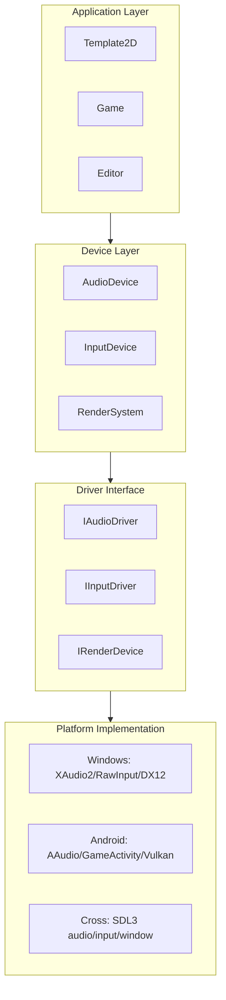
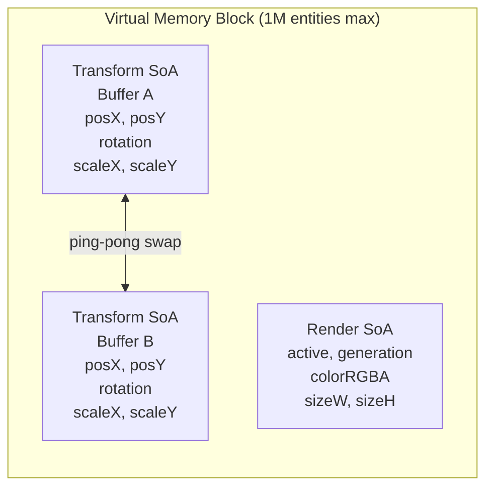
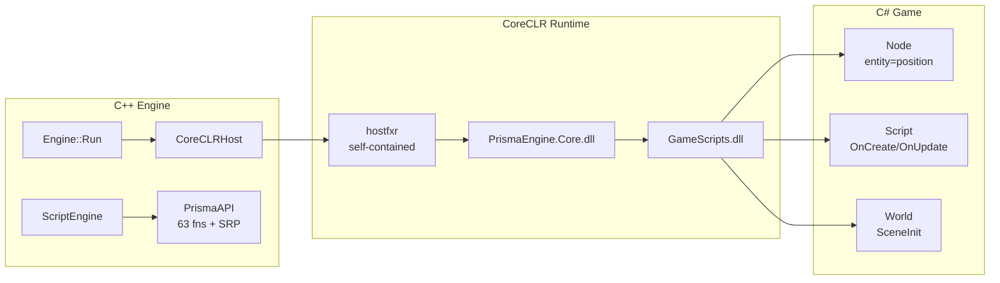

# Prisma Engine

[](https://opensource.org/licenses/MIT)
[](https://github.com/Excurs1ons/PrismaEngine)
[](https://github.com/Excurs1ons/PrismaEngine/actions)
[](https://github.com/Excurs1ons/PrismaEngine/releases/download/latest/PrismaAndroid.apk)
[](https://codewiki.google/github.com/Excurs1ons/PrismaEngine)
[](https://deepwiki.com/Excurs1ons/PrismaEngine)
[![Zread](https://img.shields.io/badge/Ask_Zread-_.svg?style=flat&color=00b0aa&labelColor=000000&logo=data%3Aimage%2Fsvg%2Bxml%3Bbase64%2CPHN2ZyB3aWR0aD0iMTYiIGhlaWdodD0iMTYiIHZpZXdCb3g9IjAgMCAxNiAxNiIgZmlsbD0ibm9uZSIgeG1sbnM9Imh0dHA6Ly93d3cudzMub3JnLzIwMDAvc3ZnIj4KPHBhdGggZD0iTTQuOTYxNTYgMS42MDAxSDIuMjQxNTZDMS44ODgxIDEuNjAwMSAxLjYwMTU2IDEuODg2NjQgMS42MDE1NiAyLjI0MDFWNC45NjAxQzEuNjAxNTYgNS4zMTM1NiAxLjg4ODEgNS42MDAxIDIuMjQxNTYgNS42MDAxSDQuOTYxNTZDNS4zMTUwMiA1LjYwMDEgNS42MDE1NiA1LjMxMzU2IDUuNjAxNTYgNC45NjAxVjIuMjQwMUM1LjYwMTU2IDEuODg2NjQgNS4zMTUwMiAxLjYwMDEgNC45NjE1NiAxLjYwMDFaIiBmaWxsPSIjZmZmIi8%2BCjxwYXRoIGQ9Ik00Ljk2MTU2IDEwLjM5OTlIMi4yNDE1NkMxLjg4ODEgMTAuMzk5OSAxLjYwMTU2IDEwLjY4NjQgMS42MDE1NiAxMS4wMzk5VjEzLjc1OTlDMS42MDE1NiAxNC4xMTM0IDEuODg4MSAxNC4zOTk5IDIuMjQxNTYgMTQuMzk5OUg0Ljk2MTU2QzUuMzE1MDIgMTQuMzk5OSA1LjYwMTU2IDE0LjExMzQgNS42MDE1NiAxMy43NTk5VjExLjAzOTlDNS42MDE1NiAxMC42ODY0IDUuMzE1MDIgMTAuMzk5OSA0Ljk2MTU2IDEwLjM5OTlaIiBmaWxsPSIjZmZmIi8%2BCjxwYXRoIGQ9Ik0xMy43NTg0IDEuNjAwMUgxMS4wMzg0QzEwLjY4NSAxLjYwMDEgMTAuMzk4NCAxLjg4NjY0IDEwLjM5ODQgMi4yNDAxVjQuOTYwMUMxMC4zOTg0IDUuMzEzNTYgMTAuNjg1IDUuNjAwMSAxMS4wMzg0IDUuNjAwMUgxMy43NTg0QzE0LjExMTkgNS42MDAxIDE0LjM5ODQgNS4zMTM1NiAxNC4zOTg0IDQuOTYwMVYyLjI0MDFDMTQuMzk4NCAxLjg4NjY0IDE0LjExMTkgMS42MDAxIDEzLjc1ODQgMS42MDAxWiIgZmlsbD0iI2ZmZiIvPgo8cGF0aCBkPSJNNCAxMkwxMiA0TDQgMTJaIiBmaWxsPSIjZmZmIi8%2BCjxwYXRoIGQ9Ik00IDEyTDEyIDQiIHN0cm9rZT0iI2ZmZiIgc3Ryb2tlLXdpZHRoPSIxLjUiIHN0cm9rZS1saW5lY2FwPSJyb3VuZCIvPgo8L3N2Zz4K&logoColor=ffffff)](https://zread.ai/Excurs1ons/PrismaEngine)
[](https://mintlify.wiki/Excurs1ons/PrismaEngine)

Prisma Engine is a cross-platform 3D game engine built with modern C++20, focusing on high-performance rendering and modern graphics architectures.

[中文文档](./docs/README_zh.md) | [English](./README.md)

> **Current Status**: CoreCLR C# scripting functional. SoA entity pool with 1M virtual capacity. Android Vulkan runtime production-ready.
> **Last Updated**: 2026-05-11

## Architecture Highlights

### Driver-Device Pattern



### SoA Entity Pool (Structure of Arrays)



### CoreCLR C# Scripting



## CI/CD Status

| Target | Platform | Status | Trigger |
|--------|----------|--------|---------|
| **CI** | Windows | [](https://github.com/Excurs1ons/PrismaEngine/actions/workflows/ci-windows.yml) | Push / PR |
| **CI** | Android | [](https://github.com/Excurs1ons/PrismaEngine/actions/workflows/ci-android.yml) | Push / PR |
| **CI** | Linux | [](https://github.com/Excurs1ons/PrismaEngine/actions/workflows/ci-linux.yml) | Push / PR |
| **Engine** | Windows | [](https://github.com/Excurs1ons/PrismaEngine/actions/workflows/build-windows-engine.yml) | Push / Manual |
| **Editor** | Windows | [](https://github.com/Excurs1ons/PrismaEngine/actions/workflows/build-windows-editor.yml) | Push / Manual |
| **Runtime** | Windows | [](https://github.com/Excurs1ons/PrismaEngine/actions/workflows/build-windows-launcher.yml) | Push / Manual |
| **Release** | All | [](https://github.com/Excurs1ons/PrismaEngine/actions/workflows/release.yml) | Tag (`v*.*.*`) |
| **SDK (ARM64)** | Linux | [](https://github.com/Excurs1ons/PrismaEngine/actions/workflows/release-sdk-linux-arm64.yml) | Tag (`v*.*.*`) |

## Current Progress

| Module | Status | Description |
|--------|--------|-------------|
| SoA Entity Pool | ✅ 100% | Virtual memory 1M capacity, double-buffered |
| CoreCLR Scripting | ✅ 95% | C# Node/Script + SRP (CommandBuffer, RendererFeature, 计算管线) |
| Rendering Architecture | ✅ 90% | Core Pass + Feature system + Compute Pipeline RHI |
| Resource Management | ✅ 95% | Handle<T> system + resource pools |
| Vulkan Backend | ✅ 90% | Robust cross-platform Vulkan implementation |
| DirectX 12 Backend | ⏳ 70% | Primary Windows rendering backend |
| Platform Layer | ✅ 95% | Unified Windows/Linux/Android abstraction |
| Logger System | ✅ 100% | Thread-safe cross-platform logging |
| Audio System | ✅ 50% | XAudio2/SDL3 backends with 3D spatial support |
| Shaders | ✅ 50% | PBR lighting shaders (lit/unlit) |
| Android Runtime | ✅ 90% | Optimized Vulkan runtime (integrated GameActivity) |
| Editor Tools | ⏳ 15% | ImGui-based inspector |
| MCP Protocol | ✅ 85% | 17 tools, 7 categories, dual transport, hash delta tracking |
| WebUI Editor | ✅ 80% | Browser-based editor with scene/game viewport, hierarchy, inspector |

**Overall: ~82%**

## Quick Start

Prisma Engine uses **CMake FetchContent** for dependency management by default - no manual library installation required.

### Windows

```bash
# Clone repository
git clone --recursive https://github.com/Excurs1ons/PrismaEngine.git
cd PrismaEngine

# Build with CMake Presets
cmake --preset windows-x64-debug
cmake --build build/windows-x64-debug --parallel
```

### Linux

```bash
# Install dependencies (Ubuntu/Debian)
sudo apt-get install libx11-dev libxrandr-dev libvulkan-dev

# Build
cmake --preset linux-x64-debug
cmake --build build/linux-x64-debug --parallel
```

### Android

```bash
# Open in Android Studio
# Path: projects/android/PrismaAndroid
# Dependencies download automatically via CMake FetchContent
```

## Using the SDK (Without Full Source)

If you just want to try out a project (like PrismaCraft) or build your own game, you don't need the full engine source — download the **prebuilt SDK** from GitHub Releases:

### Option 1: Download Prebuilt SDK (Recommended)

```bash
# 1. Download from https://github.com/Excurs1ons/PrismaEngine/releases
#    Look for: PrismaEngine-SDK-<version>-<platform>.tar.gz

# 2. Extract
tar xzf PrismaEngine-SDK-0.1.0-linux.tar.gz

# 3. Build any sample project
cd PrismaEngine-SDK-0.1.0-linux/samples/BasicTriangle
cmake -B build -DPrismaEngine_DIR=../..
cmake --build build
./build/BasicTriangle
```

### Option 2: Use SDK from Local Repo

```bash
# SDK is already in the repo at sdk/
cd sdk/samples/BasicTriangle
cmake -B build -DPrismaEngine_DIR=$(pwd)/../..
cmake --build build
./build/BasicTriangle
```

The SDK contains:
- **190+ public C++ headers** — Full engine API (`#include <PrismaEngine/PrismaEngine.h>`)
- **CMake config** — `find_package(PrismaEngine)` ready
- **Sample projects** — BasicTriangle, BlockGame, PrismaCraftStarter
- **Precompiled libraries** — Engine binaries for your platform (in release downloads)

> **Note**: Prebuilt SDK is available on [GitHub Releases](https://github.com/Excurs1ons/PrismaEngine/releases). The `sdk/` directory in the repo contains headers and CMake configs but no prebuilt binaries — those are too large for the repository.

## Documentation

- [Documentation Index](docs/Index.md) - **Start here**
- [Architecture Overview](docs/README_zh.md) - Architecture and design
- [Vulkan Integration](docs/VulkanIntegration.md) - Detailed Android implementation
- [CoreCLR Scripting Summary](docs/plans/archived/2026-05-10-coreclr-scripting-summary.md) - C# scripting implementation
- [RenderGraph Plan](docs/RenderGraphMigrationPlan.md) - Future rendering roadmap

## Core Features

- **Modern C++20**: Utilizing concepts, coroutines, and designated initializers.
- **Smart Dependency Management**: No manual library installation required; CMake handles everything.
- **Unified Rendering API**: Write once, run on DX12 or Vulkan.
- **Android Deep Optimization**: Zero-latency input via GameActivity and high-performance Vulkan rendering path.
- **CoreCLR Scripting**: Full C# scripting with SoA entity pool and self-contained deployment.
- **MCP Integration**: Full Model Context Protocol support for AI Agent control (17 tools, hash delta tracking, double transport).
- **WebUI Editor**: Browser-based full editor with real-time scene viewport, hierarchy, inspector and console.

## License

MIT License - see [LICENSE](LICENSE) for details.
