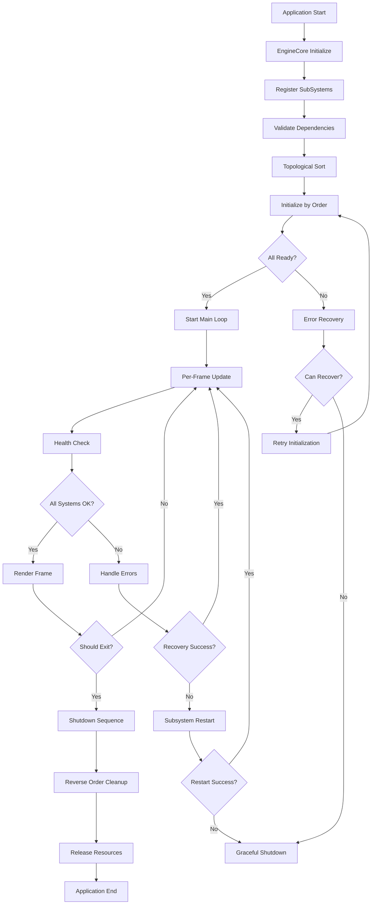
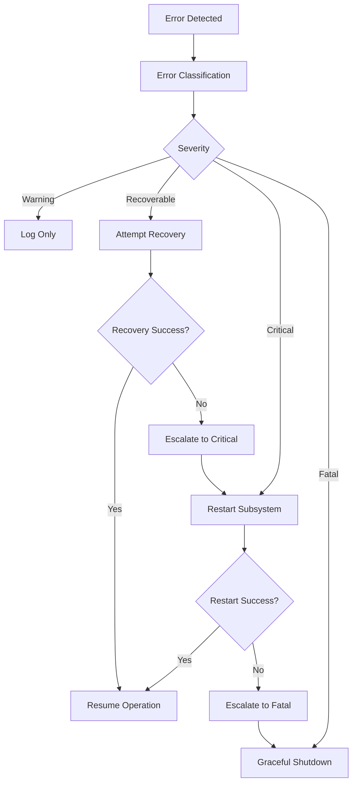

# 生命周期管理系统设计文档

## 概述

本文档描述了PrismaEngine从Application到Pipeline的完整生命周期管理系统的设计，旨在提高引擎的稳定性、可维护性和可调试性。

## 目录

- [当前系统分析](#当前系统分析)
- [问题识别](#问题识别)
- [设计目标](#设计目标)
- [架构设计](#架构设计)
- [核心组件](#核心组件)
- [实施指南](#实施指南)
- [最佳实践](#最佳实践)

## 当前系统分析

### 系统层次结构

```
Application (Application.cpp)
├── EngineCore (Engine.cpp)
    ├── SubSystems (按初始化顺序)
        ├── ThreadManager
        ├── ResourceManager
        ├── SceneManager
        ├── RenderSystem
        │   ├── RenderBackend (DirectX12/Vulkan)
        │   ├── ScriptableRenderPipeline
        │   └── ForwardPipeline
        │       ├── DepthPrePass
        │       ├── SkyboxRenderPass
        │       ├── OpaquePass
        │       └── TransparentPass
        └── PhysicsSystem
```

### 当前初始化流程

1. **Application::Initialize()** 创建EngineCore
2. **EngineCore::Initialize()** 注册并初始化子系统
3. **RenderSystem::Initialize()** 创建渲染后端和管线
4. **ForwardPipeline::Initialize()** 创建并注册RenderPass
5. **MainLoop()** 每帧调用各子系统Update()

## 问题识别

### 1️⃣ **状态管理不完善**

**当前问题：**
- 简单的布尔值`isInitialized`无法表示复杂状态
- 缺少中间状态（正在初始化、部分失败、需要重试）
- 没有状态变化的回调机制

**影响：**
- 首帧渲染崩溃
- 初始化失败时缺少详细信息
- 难以实现异步初始化

### 2️⃣ **错误处理机制薄弱**

**当前问题：**
- 初始化失败时缺少详细错误信息
- 没有错误恢复机制
- 运行时错误处理不一致

**影响：**
- 调试困难
- 系统稳定性差
- 用户体验不佳

### 3️⃣ **依赖关系管理不够严格**

**当前问题：**
- 子系统初始化顺序硬编码，缺少灵活性
- 没有循环依赖检测
- 缺少依赖注入机制

**影响：**
- 难以扩展新系统
- 模块间耦合度高
- 测试困难

### 4️⃣ **资源生命周期不够安全**

**当前问题：**
- 资源清理顺序可能出现问题
- 缺少智能指针的统一管理
- 多线程访问安全性不足

**影响：**
- 内存泄漏风险
- 程序崩溃
- 资源竞争

## 设计目标

### 🎯 **主要目标**

1. **可靠性**: 提高系统稳定性，减少崩溃
2. **可维护性**: 清晰的接口和依赖关系
3. **可调试性**: 详细的状态信息和错误报告
4. **可扩展性**: 易于添加新的子系统
5. **性能**: 最小化生命周期管理的开销

### 📊 **具体指标**

- 系统启动成功率 > 99.9%
- 错误恢复成功率 > 95%
- 内存泄漏检测覆盖率 100%
- 单元测试覆盖率 > 90%

## 架构设计

### 状态管理系统

```cpp
// 完整的状态枚举
enum class SystemState {
    Uninitialized,        // 未初始化
    Initializing,         // 正在初始化
    PartiallyInitialized, // 部分初始化
    Initialized,          // 完全初始化
    Running,             // 正在运行
    Paused,              // 暂停
    Stopping,            // 正在停止
    Stopped,             // 已停止
    Error,               // 错误状态
    Recovering           // 正在恢复
};

// 初始化结果类型
enum class InitializationResult {
    Success,           // 成功
    Pending,           // 等待中（异步初始化）
    PartialFailure,    // 部分失败
    CriticalFailure,   // 严重失败
    DependencyFailure, // 依赖失败
    RetryableFailure   // 可重试的失败
};
```

### 增强的子系统接口

```cpp
class IEnhancedSubSystem {
public:
    virtual ~IEnhancedSubSystem() = default;

    // 状态管理
    virtual SystemState GetState() const = 0;
    virtual bool IsReady() const = 0;
    virtual bool HasError() const = 0;
    virtual std::string GetLastError() const = 0;

    // 生命周期
    virtual InitializationResult Initialize() = 0;
    virtual InitializationResult InitializeAsync() = 0;
    virtual bool Shutdown() = 0;
    virtual void Update(float deltaTime) = 0;

    // 依赖管理
    virtual std::vector<std::string> GetDependencies() const = 0;
    virtual bool CheckDependencies() const = 0;
    virtual void RegisterDependency(std::shared_ptr<IEnhancedSubSystem> dependency) = 0;

    // 错误恢复
    virtual bool Recover() = 0;
    virtual bool CanRecover() const = 0;

    // 事件回调
    virtual void OnStateChanged(SystemState oldState, SystemState newState) {}
    virtual void OnDependencyReady(const std::string& dependencyName) {}
    virtual void OnDependencyFailed(const std::string& dependencyName, const std::string& error) {}
};
```

### 错误处理系统

```cpp
enum class ErrorSeverity {
    Warning,     // 警告，不影响运行
    Recoverable, // 可恢复错误
    Critical,    // 严重错误，需要重启子系统
    Fatal        // 致命错误，需要关闭应用
};

class ErrorHandler {
public:
    struct ErrorInfo {
        ErrorSeverity severity;
        std::string component;
        std::string message;
        std::chrono::system_clock::time_point timestamp;
        int occurrenceCount = 1;
    };

    static void ReportError(const ErrorInfo& error);
    static std::vector<ErrorInfo> GetRecentErrors(size_t count = 10);
    static void ClearErrorHistory();
};
```

## 核心组件

### 1️⃣ **增强的EngineCore**

负责：
- 子系统注册和初始化顺序管理
- 依赖关系验证
- 全局状态协调
- 错误处理和恢复

### 2️⃣ **改进的RenderPass基类**

```cpp
class EnhancedRenderPass : public RenderPass {
public:
    enum class PassState {
        Uninitialized,
        Initializing,
        Ready,
        Rendering,
        Completed,
        Error,
        Recovering
    };

    // 安全执行包装
    void ExecuteSafely(RenderCommandContext* context);

    // 状态查询
    PassState GetState() const;
    bool IsReady() const;
    std::string GetLastError() const;

protected:
    // 资源验证
    virtual bool ValidateResources() = 0;
    virtual bool CanRecover() const = 0;
    virtual void AttemptRecovery() = 0;
};
```

### 3️⃣ **资源管理系统**

```cpp
class ResourceManager {
public:
    template<typename T>
    class ResourceHandle {
        // 智能资源句柄，自动管理生命周期
    };

    template<typename T, typename... Args>
    ResourceHandle<T> CreateResource(Args&&... args);

    void CleanupResources();
    void ValidateResourceDependencies();
};
```

### 4️⃣ **依赖注入容器**

```cpp
class DependencyInjectionContainer {
public:
    template<typename Interface, typename Implementation, typename... Args>
    void RegisterSingleton(Args&&... args);

    template<typename T>
    std::shared_ptr<T> Resolve();

    void ValidateDependencies();
};
```

## 实施指南

### 阶段1: 基础状态管理（1-2周）

**目标**: 实现基本的状态管理和错误处理

**任务**:
1. 实现状态枚举和基础接口
2. 为RenderPass添加状态管理
3. 实现基础的错误报告系统
4. 添加日志记录改进

**代码示例**:
```cpp
// 在SkyboxRenderPass中
class ImprovedSkyboxRenderPass : public EnhancedRenderPass {
public:
    bool Initialize() override {
        m_state = PassState::Initializing;

        if (!CompileShader()) {
            m_lastError = "Shader compilation failed";
            m_state = PassState::Error;
            return false;
        }

        m_state = PassState::Ready;
        return true;
    }

    void ExecuteSafely(RenderCommandContext* context) override {
        if (!IsReady()) {
            ErrorHandler::ReportError({
                ErrorSeverity::Warning,
                GetName(),
                "Attempting to execute unready render pass"
            });
            return;
        }

        EnhancedRenderPass::ExecuteSafely(context);
    }
};
```

### 阶段2: 增强错误处理（2-3周）

**目标**: 实现完整的错误处理和恢复机制

**任务**:
1. 实现ErrorHandler类
2. 添加错误恢复策略
3. 实现子系统重启机制
4. 添加错误统计和报告

### 阶段3: 依赖注入（1-2周）

**目标**: 实现依赖注入系统，减少模块耦合

**任务**:
1. 实现DependencyInjectionContainer
2. 重构现有系统使用依赖注入
3. 添加依赖关系验证
4. 实现自动装配

### 阶段4: 资源管理优化（1-2周）

**目标**: 实现智能资源管理和清理

**任务**:
1. 实现ResourceManager
2. 使用智能指针替换原始指针
3. 实现资源依赖跟踪
4. 添加内存泄漏检测

### 阶段5: 测试和优化（2-3周）

**目标**: 完善测试覆盖和性能优化

**任务**:
1. 编写单元测试
2. 集成测试和压力测试
3. 性能分析和优化
4. 文档完善

## 最佳实践

### 1️⃣ **初始化最佳实践**

```cpp
// ✅ 推荐的初始化模式
InitializationResult MySubSystem::Initialize() {
    SetState(SystemState::Initializing);

    // 1. 检查依赖
    if (!CheckDependencies()) {
        SetLastError("Dependencies not satisfied");
        return InitializationResult::DependencyFailure;
    }

    // 2. 初始化资源
    if (!InitializeResources()) {
        SetLastError("Resource initialization failed");
        return InitializationResult::RetryableFailure;
    }

    // 3. 验证状态
    if (!ValidateConfiguration()) {
        SetLastError("Configuration validation failed");
        return InitializationResult::CriticalFailure;
    }

    SetState(SystemState::Initialized);
    return InitializationResult::Success;
}
```

### 2️⃣ **错误处理最佳实践**

```cpp
// ✅ 推荐的错误处理模式
void SafeExecute() {
    try {
        DoWork();
    } catch (const ShaderCompilationError& e) {
        ErrorHandler::ReportError({
            ErrorSeverity::Recoverable,
            "RenderSystem",
            e.what()
        });

        // 尝试重新编译着色器
        if (!RecompileShader()) {
            SetState(SystemState::Error);
        }
    } catch (const DeviceLostError& e) {
        ErrorHandler::ReportError({
            ErrorSeverity::Critical,
            "RenderSystem",
            e.what()
        });

        // 需要重新创建设备
        RequestDeviceReset();
    }
}
```

### 3️⃣ **资源管理最佳实践**

```cpp
// ✅ 推荐的资源管理模式
class MyRenderPass : public EnhancedRenderPass {
public:
    bool Initialize() override {
        // 使用资源句柄确保自动清理
        m_shader = m_resourceManager->CreateResource<Shader>();
        m_buffer = m_resourceManager->CreateResource<VertexBuffer>();

        return ValidateResources();
    }

private:
    ResourceManager::ResourceHandle<Shader> m_shader;
    ResourceManager::ResourceHandle<VertexBuffer> m_buffer;
    ResourceManager* m_resourceManager;
};
```

### 4️⃣ **测试策略**

```cpp
// ✅ 状态转换测试
TEST(MySubSystemTest, StateTransitions) {
    auto system = std::make_shared<MySubSystem>();

    // 初始状态
    EXPECT_EQ(system->GetState(), SystemState::Uninitialized);

    // 成功初始化
    EXPECT_EQ(system->Initialize(), InitializationResult::Success);
    EXPECT_EQ(system->GetState(), SystemState::Initialized);
    EXPECT_TRUE(system->IsReady());

    // 错误恢复
    system->SimulateError();
    EXPECT_EQ(system->GetState(), SystemState::Error);
    EXPECT_TRUE(system->CanRecover());

    EXPECT_TRUE(system->Recover());
    EXPECT_EQ(system->GetState(), SystemState::Initialized);
}
```

## 监控和诊断

### 性能指标

- **启动时间**: 各子系统初始化耗时
- **错误率**: 各组件错误发生频率
- **恢复成功率**: 错误恢复成功的比例
- **内存使用**: 资源创建和释放情况

### 调试工具

1. **状态查看器**: 实时查看所有子系统状态
2. **错误历史**: 查看最近的错误和恢复情况
3. **依赖图**: 可视化系统依赖关系
4. **资源追踪**: 监控资源创建和释放

### 日志记录

```cpp
// 结构化日志示例
LOG_INFO("RenderPass", "Execution completed",
         LogField("pass_name", GetName()),
         LogField("duration_ms", duration),
         LogField("draw_calls", drawCalls),
         LogField("triangles", triangleCount));
```

## 流程图

### 完整生命周期流程



### 错误处理流程



## 总结

这个增强的生命周期管理系统将显著提高PrismaEngine的稳定性和可维护性。通过实施分阶段的改进计划，我们可以：

1. **解决首帧崩溃问题** ✅ 已完成
2. **提高系统可靠性** - 通过状态管理和错误恢复
3. **改善调试体验** - 通过详细的日志和状态信息
4. **支持未来扩展** - 通过依赖注入和模块化设计

该系统的成功实施将为PrismaEngine的持续发展奠定坚实的基础。