# YAGE 开发备忘录

## 项目概述
YAGE (Yet Another Game Engine) 是一个跨平台游戏引擎，支持Windows和Android平台。

## 技术栈
- **编程语言**: C++20
- **图形API**: DirectX 12, Vulkan (计划中)
- **窗口和输入**: SDL3
- **构建系统**: Visual Studio 2022
- **包管理**: vcpkg
- **依赖管理**: 通过vcpkg.json文件

## 项目结构
```
YAGE/
├── Engine/           # 核心引擎代码
├── Editor/           # 编辑器应用
├── Runtime/          # 游戏运行时实现
├── Assets/           # 游戏资源
└── Docs/             # 文档 (计划中)
```

## 核心系统

### 渲染系统
- DirectX 12 实现
- 着色器编译 (使用HLSL)
- 资源管理

### 音频系统
- 多后端支持 (XAudio2, SDL Audio)
- WAV文件支持

### 输入系统
- 键盘和鼠标输入
- 控制器支持 (计划中)

### 资源管理
- 统一资源加载接口
- 文件系统抽象

## Runtime执行流程 (仿照UnityPlayer)

### 整体架构
```
Runtime启动 → 引擎核心初始化 → 脚本系统初始化 → 场景加载 → 主循环 → 退出清理
```

### 详细执行流程

1. **Runtime入口点**
   - 平台检测和特定初始化
   - 日志系统初始化
   - 创建应用程序实例

2. **引擎核心初始化阶段**
   - 平台抽象层初始化
   - 资源管理系统初始化
   - 渲染系统初始化
   - 音频系统初始化
   - 输入系统初始化

3. **脚本系统初始化阶段 (类似Mono/IL2CPP)**
   - 初始化脚本虚拟机环境
   - 加载托管代码程序集
   - 注册内部调用函数
   - 初始化脚本域和基本类型
   - 执行RuntimeInitializeOnLoadMethod标记的方法

4. **启动画面和初始场景加载**
   - 显示启动画面（如果有配置）
   - 加载初始场景
   - 实例化场景中的游戏对象
   - 调用所有脚本组件的Awake方法

5. **主循环阶段**
   - 处理系统事件
   - 调用脚本组件的Update方法
   - 执行物理模拟更新
   - 执行渲染管线
   - 处理音频更新
   - 调用LateUpdate等后续更新方法

6. **退出和清理阶段**
   - 保存游戏数据
   - 调用OnDestroy等销毁方法
   - 释放资源
   - 关闭脚本系统
   - 关闭子系统
   - 终止进程

### 流程图

```mermaid
graph TD
    A[Runtime启动] --> B[平台检测]
    B --> C[日志系统初始化]
    C --> D[创建应用程序实例]
    D --> E[引擎核心初始化]
    E --> F[平台抽象层初始化]
    F --> G[资源管理器初始化]
    G --> H[渲染系统初始化]
    H --> I[音频系统初始化]
    I --> J[输入系统初始化]
    J --> K[脚本系统初始化]
    K --> L[初始化脚本虚拟机]
    L --> M[加载程序集]
    M --> N[注册内部调用]
    N --> O[初始化脚本域]
    O --> P[执行RuntimeInitialize方法]
    P --> Q[启动画面/场景加载]
    Q --> R[显示启动画面]
    R --> S[加载初始场景]
    S --> T[实例化游戏对象]
    T --> U[调用Awake方法]
    U --> V[主循环开始]
    V --> W[事件处理]
    W --> X[脚本Update调用]
    X --> Y[物理系统更新]
    Y --> Z[渲染管线执行]
    Z --> AA[音频更新]
    AA --> AB[脚本LateUpdate调用]
    AB --> AC{是否退出?}
    AC -->|否| V
    AC -->|是| AD[退出清理]
    AD --> AE[保存游戏数据]
    AE --> AF[调用OnDestroy]
    AF --> AG[释放资源]
    AG --> AH[关闭脚本系统]
    AH --> AI[关闭子系统]
    AI --> AJ[进程终止]
```


## 引擎类和函数规划

### 核心类结构

#### 1. 应用程序类
```
IApplication (接口)
├── ApplicationWindows (Windows实现)
├── ApplicationAndroid (Android实现)
└── ApplicationSDL (SDL实现)
```

**主要函数：**
- `Initialize()` - 初始化应用程序
- `Run()` - 运行主循环
- `Shutdown()` - 关闭应用程序
- `Tick(float deltaTime)` - 每帧更新

#### 2. 平台抽象类
```
IPlatform (接口)
├── PlatformWindows (Windows平台实现)
├── PlatformAndroid (Android平台实现)
└── PlatformSDL (SDL平台实现)
```

**主要函数：**
- `InitPlatform()` - 初始化平台
- `ShutdownPlatform()` - 关闭平台
- `PumpEvents()` - 处理事件
- `GetTimeSeconds()` - 获取时间（秒）
- `GetTimeMicroseconds()` - 获取时间（微秒）
- `IsKeyDown()` - 检查按键状态
- `CreateWindow()` - 创建窗口
- `GetWindowSize()` - 获取窗口大小

#### 3. 渲染系统类
```
IRenderBackend (接口)
├── RendererDirectX (DirectX 12实现)
├── RendererVulkan (Vulkan实现)
└── RendererOpenGL (OpenGL实现，计划中)
```

**主要函数：**
- `Initialize()` - 初始化渲染器
- `Shutdown()` - 关闭渲染器
- `BeginFrame()` - 开始帧渲染
- `EndFrame()` - 结束帧渲染
- `Present()` - 呈现帧
- `SubmitRenderCommand()` - 提交渲染命令

#### 4. 资源管理系统类
```
ResourceManager (单例)
├── IResource (资源接口)
│   ├── Mesh
│   ├── Texture
│   ├── Shader
│   └── Material
└── ResourceHandle<T> (模板类)
```

**主要函数：**
- `Initialize()` - 初始化资源管理器
- `Shutdown()` - 关闭资源管理器
- `Load<T>(path)` - 加载资源
- `Unload(name)` - 卸载资源
- `Get<T>(name)` - 获取资源

#### 5. 音频系统类
```
AudioSystem (单例)
├── IAudioBackend (接口)
│   ├── AudioBackendXAudio2 (XAudio2实现)
│   └── AudioBackendSDL (SDL实现)
└── AudioClip
```

**主要函数：**
- `Initialize()` - 初始化音频系统
- `Shutdown()` - 关闭音频系统
- `PlaySound()` - 播放声音
- `StopSound()` - 停止声音
- `SetMasterVolume()` - 设置主音量

#### 6. 场景管理系统类
```
Scene (场景)
├── GameObject (游戏对象)
│   └── Component (组件)
│       └── ScriptComponent (脚本组件)
├── Transform (变换)
└── SceneManager (场景管理器)
```

**主要函数：**
- `Scene::Load()` - 加载场景
- `Scene::Unload()` - 卸载场景
- `GameObject::AddComponent<T>()` - 添加组件
- `GameObject::GetComponent<T>()` - 获取组件
- `Component::Awake()` - 组件唤醒
- `Component::Start()` - 组件开始
- `Component::Update(float deltaTime)` - 组件更新
- `Component::LateUpdate(float deltaTime)` - 组件后期更新
- `Component::OnDestroy()` - 组件销毁

#### 7. 脚本系统类（类似Mono）
```
ScriptEngine (脚本引擎)
├── ScriptDomain (脚本域)
├── ScriptAssembly (脚本程序集)
└── ScriptObject (脚本对象)
```

**主要函数：**
- `Initialize()` - 初始化脚本引擎
- `Shutdown()` - 关闭脚本引擎
- `LoadAssemblies()` - 加载程序集
- `ExecuteRuntimeInitializeMethods()` - 执行RuntimeInitialize方法
- `CallAwakeOnAllScripts()` - 调用所有脚本的Awake方法
- `CallUpdateOnAllScripts(float deltaTime)` - 调用所有脚本的Update方法
- `CallLateUpdateOnAllScripts(float deltaTime)` - 调用所有脚本的LateUpdate方法

#### 8. 输入系统类
```
InputManager (单例)
├── KeyCode (枚举)
└── MouseButton (枚举)
```

**主要函数：**
- `IsKeyPressed()` - 检查按键是否被按下
- `IsKeyDown()` - 检查按键是否刚刚按下
- `IsKeyUp()` - 检查按键是否刚刚释放
- `GetMousePosition()` - 获取鼠标位置
- `IsMouseButtonDown()` - 检查鼠标按键是否被按下

### 主要执行函数流程

#### Runtime启动流程
```cpp
int main() {
    // 1. 平台检测和初始化
    auto& app = Application::Create();
    
    // 2. 初始化应用程序
    if (!app.Initialize()) {
        return -1;
    }
    
    // 3. 运行主循环
    int result = app.Run();
    
    // 4. 关闭应用程序
    app.Shutdown();
    
    return result;
}
```

#### 应用程序初始化流程
```cpp
bool Application::Initialize() {
    // 1. 初始化日志系统
    Logger::Initialize();
    
    // 2. 初始化平台抽象层
    m_Platform->InitPlatform();
    
    // 3. 初始化资源管理器
    ResourceManager::Initialize();
    
    // 4. 初始化渲染系统
    m_Renderer->Initialize();
    
    // 5. 初始化音频系统
    m_AudioSystem->Initialize();
    
    // 6. 初始化输入系统
    InputManager::Initialize();
    
    // 7. 初始化脚本系统
    ScriptEngine::Initialize();
    
    return true;
}
```

#### 主循环流程
```cpp
int Application::Run() {
    while (!m_ShouldClose) {
        // 1. 计算帧时间
        float deltaTime = CalculateDeltaTime();
        
        // 2. 处理平台事件
        m_Platform->PumpEvents();
        
        // 3. 更新输入系统
        InputManager::Update();
        
        // 4. 调用脚本Update
        ScriptEngine::CallUpdateOnAllScripts(deltaTime);
        
        // 5. 物理系统更新
        PhysicsSystem::Update(deltaTime);
        
        // 6. 渲染管线执行
        m_Renderer->BeginFrame();
        // ... 渲染命令提交 ...
        m_Renderer->EndFrame();
        m_Renderer->Present();
        
        // 7. 音频更新
        m_AudioSystem->Update();
        
        // 8. 调用脚本LateUpdate
        ScriptEngine::CallLateUpdateOnAllScripts(deltaTime);
    }
    
    return 0;
}
```

#### 场景加载流程
```cpp
void SceneManager::LoadScene(const std::string& scenePath) {
    // 1. 卸载当前场景
    UnloadCurrentScene();
    
    // 2. 加载新场景
    m_CurrentScene = ResourceManager::Load<Scene>(scenePath);
    
    // 3. 实例化场景中的游戏对象
    m_CurrentScene->InstantiateObjects();
    
    // 4. 调用所有脚本的Awake方法
    ScriptEngine::CallAwakeOnAllScripts();
    
    // 5. 调用所有脚本的Start方法
    ScriptEngine::CallStartOnAllScripts();
}
```

## 开发环境设置

1. 安装 Visual Studio 2022
2. 安装 Windows 10 SDK
3. 克隆 vcpkg 并安装依赖:
   ```
   vcpkg install
   ```

## 常用命令

### 构建项目
在Visual Studio中打开解决方案并构建

### 运行测试
(待实现)

## 编码规范

### 命名约定
- 类名: PascalCase
- 函数名: CamelCase
- 成员变量: m_camelCase
- 常量: UPPER_CASE

### 注释规范
- 使用中文注释
- 类和函数需要详细注释
- 复杂逻辑需要行内注释

## 版本控制

### 分支策略
- main: 稳定版本
- develop: 开发分支
- feature/*: 功能分支

### 提交信息
使用中文提交信息，格式:
```
[模块] 简述修改内容

详细描述 (可选)
```

## 待办事项

### 高优先级
- [ ] 完善资源管理系统
- [ ] 实现Vulkan渲染后端
- [ ] 添加更多着色器示例

### 中优先级
- [ ] 实现模型加载
- [ ] 添加音频格式支持
- [ ] 完善编辑器功能

### 低优先级
- [ ] 实现粒子系统
- [ ] 添加物理引擎
- [ ] 支持更多平台

## 常见问题

### 构建失败
1. 确保已安装所有依赖
2. 检查Windows SDK版本
3. 确认vcpkg集成正确

### 运行时错误
1. 检查DirectX兼容性
2. 确认显卡驱动更新

## 参考资料
- [DirectX-Graphics-Samples](https://github.com/microsoft/DirectX-Graphics-Samples)
- [SDL3 Documentation](https://wiki.libsdl.org/SDL3/)
- [vcpkg Documentation](https://vcpkg.io/en/index.html)