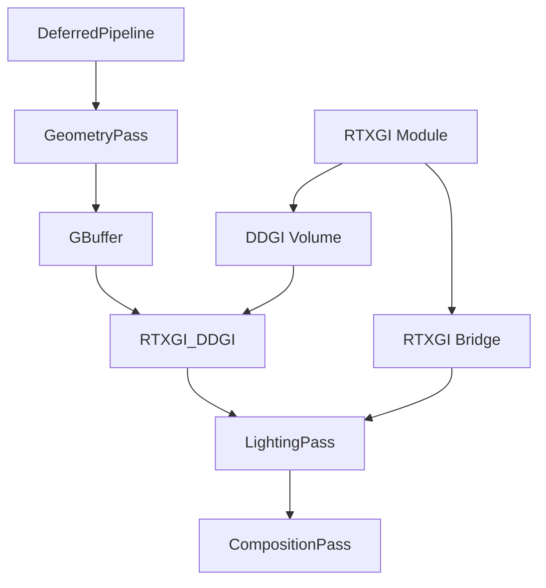

# RTXGI 集成接口设计文档

## 概述

本文档描述了PrismaEngine延迟渲染管线与NVIDIA RTXGI (Real-Time Ray-Tracing Global Illumination)的集成接口设计。RTXGI提供了实时的光线追踪全局照明解决方案，可以显著提升渲染质量。

## 集成架构

### 延迟渲染管线中的RTXGI集成点



## 核心接口设计

### 1. RTXGI管理器接口

```cpp
// src/engine/graphic/rtxgi/RTXGIManager.h
#pragma once

#include <memory>
#include <vector>
#include <DirectXMath.h>
#include <winrt/base.h>

// RTXGI前置声明
namespace nvrhi {
    class IDevice;
    class ICommandList;
}

namespace NVSDK_NGX {
    struct Parameter;
}

namespace Engine {
namespace Graphic {
namespace RTXGI {

/**
 * RTXGI集成管理器
 * 负责管理RTXGI的初始化、配置和与延迟渲染管线的集成
 */
class RTXGIManager {
public:
    struct DDGIConfiguration {
        // DDGI体积配置
        DirectX::XMFLOAT3 probeSpacing = { 2.0f, 2.0f, 2.0f };
        DirectX::XMFLOAT3 volumeSize = { 64.0f, 32.0f, 64.0f };
        DirectX::XMFLOAT3 volumeOffset = { 0.0f, 0.0f, 0.0f };

        // 质量设置
        int probeRayCount = 256;
        float probeMaxRayDistance = 50.0f;
        float probeHysteresis = 0.98f;
        float probeNormalBias = 0.1f;
        float probeViewBias = 0.0f;

        // 更新频率
        bool infiniteBounce = true;
        float probeIrradianceGamma = 1.0f;
        float probeIrradianceScale = 1.0f;

        // 渲染目标设置
        bool probeRelocationEnabled = true;
        bool probeClassificationEnabled = true;
        bool probeEndianSwapEnabled = false;
        bool probeDistanceBiasEnabled = true;
    };

    /**
     * 初始化RTXGI系统
     */
    bool Initialize(nvrhi::IDevice* device, const DDGIConfiguration& config);

    /**
     * 关闭RTXGI系统
     */
    void Shutdown();

    /**
     * 每帧更新
     */
    void Update(nvrhi::ICommandList* commandList,
                const DirectX::XMMATRIX& viewMatrix,
                const DirectX::XMMATRIX& projMatrix);

    /**
     * 获取DDGI体积的渲染目标
     */
    nvrhi::ITexture* GetDDGIIrradianceTexture() const;
    nvrhi::ITexture* GetDDGIDistanceTexture() const;
    nvrhi::ITexture* GetDDGIOffsetsTexture() const;

    /**
     * 获取DDGI描述符
     */
    uint32_t GetDDGIIrradianceUAV() const;
    uint32_t GetDDGIDistanceUAV() const;
    uint32_t GetDDGIOffsetsUAV() const;
    uint32_t GetDDGIConstantsSRV() const;

    /**
     * 检查RTXGI是否可用
     */
    bool IsAvailable() const;

    /**
     * 启用/禁用RTXGI
     */
    void SetEnabled(bool enabled);
    bool IsEnabled() const;

private:
    class Impl;
    std::unique_ptr<Impl> m_impl;
};

} // namespace RTXGI
} // namespace Graphic
} // namespace Engine
```

### 2. 延迟渲染管线集成接口

```cpp
// 在DeferredPipeline中添加RTXGI支持
class DeferredPipeline {
private:
    // RTXGI管理器
    std::unique_ptr<RTXGI::RTXGIManager> m_rtxgiManager;

    // RTXGI渲染目标
    void* m_ddgiIrradianceTexture = nullptr;
    void* m_ddgiDistanceTexture = nullptr;
    void* m_ddgiOffsetsTexture = nullptr;

    // RTXGI配置
    bool m_rtxgiEnabled = false;
    RTXGI::RTXGIManager::DDGIConfiguration m_rtxgiConfig;

public:
    /**
     * 初始化RTXGI（可选）
     */
    bool InitializeRTXGI(const RTXGI::RTXGIManager::DDGIConfiguration& config);

    /**
     * 更新RTXGI（每帧调用）
     */
    void UpdateRTXGI(RenderCommandContext* context);

    /**
     * 在光照通道中集成RTXGI
     */
    void ApplyRTXGIIllumination(RenderCommandContext* context);
};
```

## 集成实现细节

### 1. 几何通道集成

在GeometryPass中添加RTXGI所需的数据输出：

```cpp
// 在GeometryPass的Execute方法中添加
void GeometryPass::Execute(RenderCommandContext* context) {
    // ... 现有代码 ...

    // RTXGI集成点1: 输出额外的几何信息供RTXGI使用
    if (m_rtxgiManager && m_rtxgiManager->IsEnabled()) {
        // 绑定RTXGI相关资源
        context->SetShaderResource("RTXGI_DDGIIrradiance", m_ddgiIrradianceTexture);
        context->SetShaderResource("RTXGI_DDGIDistance", m_ddgiDistanceTexture);

        // 设置RTXGI常量
        context->SetConstantBuffer("RTXGI_DDGIConstants", GetRTXGIConstants());
    }

    // ... 渲染代码 ...
}
```

### 2. 光照通道集成

在LightingPass中应用RTXGI全局照明：

```cpp
// 在LightingPass的Execute方法中添加
void LightingPass::Execute(RenderCommandContext* context) {
    // ... 现有代码 ...

    // RTXGI集成点2: 应用DDGI全局照明
    if (m_rtxgiManager && m_rtxgiManager->IsEnabled()) {
        ApplyRTXGIIllumination(context);
    } else {
        // 回退到传统光照
        ApplyTraditionalLighting(context);
    }

    // ... 后续代码 ...
}

void LightingPass::ApplyRTXGIIllumination(RenderCommandContext* context) {
    // 设置RTXGI着色器
    context->SetShader(m_rtxgiLightingShader.get());

    // 绑定DDGI纹理
    context->SetShaderResource("DDGI_Irradiance", m_rtxgiManager->GetDDGIIrradianceTexture());
    context->SetShaderResource("DDGI_Distance", m_rtxgiManager->GetDDGIDistanceTexture());
    context->SetShaderResource("DDGI_Offsets", m_rtxgiManager->GetDDGIOffsetsTexture());

    // 设置RTXGI常量缓冲区
    struct RTXGIConstants {
        DirectX::XMMATRIX inverseViewProjection;
        DirectX::XMFLOAT3 probeWorldOrigin;
        float probeSpacing;
        DirectX::XMUINT3 probeCounts;
        uint32_t padding;
        DirectX::XMFLOAT3 probeVolumeSize;
        float probeMaxRayDistance;
        // ... 其他RTXGI参数
    } rtxgiConstants;

    // 填充RTXGI常量
    FillRTXGIConstants(rtxgiConstants);
    context->SetConstantBuffer("RTXGI_Constants", &rtxgiConstants, sizeof(RTXGIConstants));

    // 渲染RTXGI照明
    RenderFullScreenQuad(context);
}
```

### 3. 着色器集成

在延迟渲染着色器中添加RTXGI支持：

```hlsl
// 在DEFERRED_LIGHTING_PIXEL_SHADER中添加
Texture2D DDGI_IrradianceTexture : register(t10);
Texture2D DDGI_DistanceTexture : register(t11);
Texture2D DDGI_OffsetsTexture : register(t12);
SamplerState DDGI_Sampler : register(s5);

cbuffer RTXGIConstants : register(b10) {
    matrix InverseViewProjection;
    float3 ProbeWorldOrigin;
    float ProbeSpacing;
    uint3 ProbeCounts;
    float ProbeMaxRayDistance;
    float3 ProbeVolumeSize;
    bool RTXGI_Enabled;
};

// RTXGI DDGI采样函数
float3 SampleDDGI(float3 worldPos, float3 worldNormal) {
    if (!RTXGI_Enabled) {
        return float3(0, 0, 0);
    }

    // 计算探头坐标
    float3 localPos = worldPos - ProbeWorldOrigin;
    float3 probeCoords = localPos / ProbeSpacing;

    // 边界检查
    if (any(probeCoords < 0) || any(probeCoords >= ProbeCounts)) {
        return float3(0, 0, 0);
    }

    // 简化的DDGI采样（实际实现会更复杂）
    float2 uv = probeCoords.xz / float2(ProbeCounts.xz);
    float3 irradiance = DDGI_IrradianceTexture.Sample(DDGI_Sampler, uv).rgb;

    return irradiance;
}

// 在主光照计算中集成
float4 PSMain(PS_IN input) : SV_TARGET {
    // ... 现有G-Buffer采样代码 ...

    float3 finalColor = float3(0, 0, 0);

    // 应用RTXGI全局照明
    if (RTXGI_Enabled) {
        float3 giContribution = SampleDDGI(worldPos, worldNormal);
        finalColor += giContribution * albedo;
    } else {
        // 传统光照
        finalColor += CalculatePBR(albedo, metallic, roughness, worldNormal, viewDir, lightDir, lightColor);
    }

    // ... 后续代码 ...
}
```

## 配置和管理

### 1. 引擎配置

在引擎配置中添加RTXGI相关设置：

```cpp
// EngineConfig.h
struct EngineConfig {
    // ... 其他配置 ...

    // RTXGI配置
    struct {
        bool enabled = false;
        bool autoDetect = true;
        RTXGI::RTXGIManager::DDGIConfiguration ddgiConfig;
    } rtxgi;
};
```

### 2. 运行时控制

```cpp
// 提供运行时RTXGI控制接口
class RenderingAPI {
public:
    // 启用/禁用RTXGI
    void SetRTXGIEnabled(bool enabled);
    bool IsRTXGIEnabled() const;

    // 更新RTXGI质量设置
    void UpdateRTXGIQuality(int qualityLevel);

    // 重置RTXGI体积
    void ResetRTXGIVolume();

    // 获取RTXGI统计信息
    struct RTXGIStats {
        bool available;
        bool enabled;
        float updateTime;
        int probeCount;
        float memoryUsage;
    };
    RTXGIStats GetRTXGIStats() const;
};
```

## 性能优化

### 1. 条件编译

```cpp
// 使用条件编译控制RTXGI功能
#ifdef ENABLE_RTXGI
    // RTXGI相关代码
#endif
```

### 2. 运行时切换

```cpp
// 提供运行时切换机制
void DeferredPipeline::SetRTXGIQuality(RTXGIQuality quality) {
    switch (quality) {
        case RTXGIQuality::Off:
            m_rtxgiEnabled = false;
            break;
        case RTXGIQuality::Low:
            m_rtxgiConfig.probeRayCount = 64;
            m_rtxgiConfig.probeSpacing = DirectX::XMFLOAT3(4.0f, 4.0f, 4.0f);
            break;
        case RTXGIQuality::Medium:
            m_rtxgiConfig.probeRayCount = 128;
            m_rtxgiConfig.probeSpacing = DirectX::XMFLOAT3(3.0f, 3.0f, 3.0f);
            break;
        case RTXGIQuality::High:
            m_rtxgiConfig.probeRayCount = 256;
            m_rtxgiConfig.probeSpacing = DirectX::XMFLOAT3(2.0f, 2.0f, 2.0f);
            break;
        case RTXGIQuality::Ultra:
            m_rtxgiConfig.probeRayCount = 512;
            m_rtxgiConfig.probeSpacing = DirectX::XMFLOAT3(1.0f, 1.0f, 1.0f);
            break;
    }

    // 重新配置RTXGI
    if (m_rtxgiManager) {
        m_rtxgiManager->Shutdown();
        m_rtxgiManager->Initialize(m_device, m_rtxgiConfig);
    }
}
```

## 兼容性考虑

### 1. 硬件要求检查

```cpp
bool CheckRTXGISupport() {
    // 检查DXR支持
    bool dxrSupported = CheckDXRSupport();

    // 检查驱动版本
    bool driverSupported = CheckDriverVersion();

    // 检查GPU型号
    bool gpuSupported = CheckGPUSupport();

    return dxrSupported && driverSupported && gpuSupported;
}
```

### 2. 优雅降级

```cpp
void InitializeLightingSystem() {
    // 尝试初始化RTXGI
    if (CheckRTXGISupport()) {
        if (InitializeRTXGI()) {
            LOG_INFO("Renderer", "RTXGI initialized successfully");
            m_lightingMode = LightingMode::RTXGI;
            return;
        }
    }

    // 回退到传统延迟渲染
    LOG_WARNING("Renderer", "RTXGI not available, falling back to traditional deferred lighting");
    m_lightingMode = LightingMode::Traditional;
    InitializeTraditionalLighting();
}
```

## 调试和可视化

### 1. RTXGI调试视图

```cpp
// 提供RTXGI调试可视化
class RTXGIDebugView {
public:
    enum DebugMode {
        None,
        Irradiance,
        Distance,
        Probes,
        Normals,
        Albedo
    };

    void SetDebugMode(DebugMode mode);
    void RenderDebugOverlay(RenderCommandContext* context);
};
```

### 2. 性能分析

```cpp
// RTXGI性能分析工具
class RTXGIProfiler {
public:
    struct FrameStats {
        float ddgiUpdateTime;
        float probeBlendingTime;
        int activeProbes;
        float memoryUsageMB;
        float gpuUtilization;
    };

    FrameStats GetFrameStats() const;
    void ResetCounters();
};
```

## 总结

RTXGI集成接口设计遵循以下原则：

1. **模块化设计**: RTXGI作为可选模块，不影响现有渲染管线
2. **性能优先**: 提供多种质量级别，支持运行时调整
3. **兼容性**: 自动检测硬件支持，优雅降级
4. **易用性**: 提供简单的API接口，隐藏复杂性
5. **可调试**: 丰富的调试工具和性能分析

这个设计为PrismaEngine的未来RTXGI集成提供了完整的框架支持。