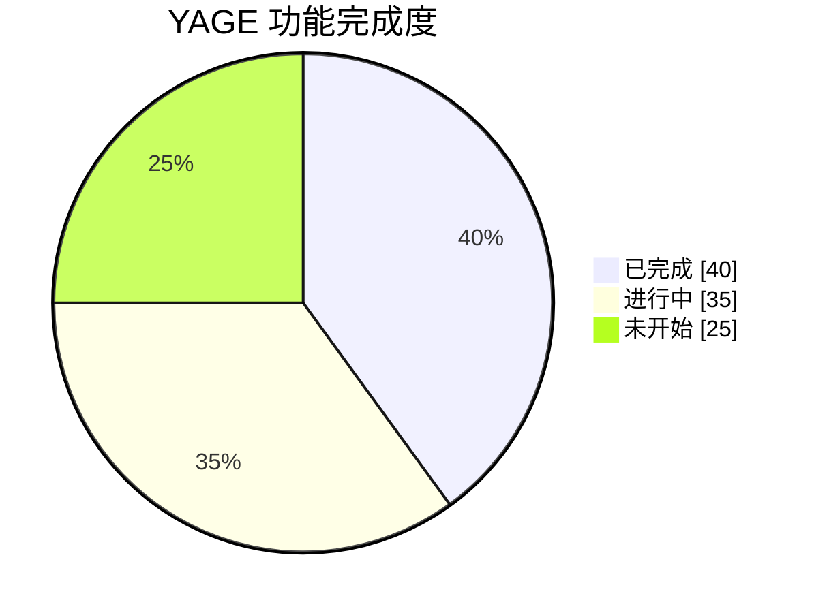
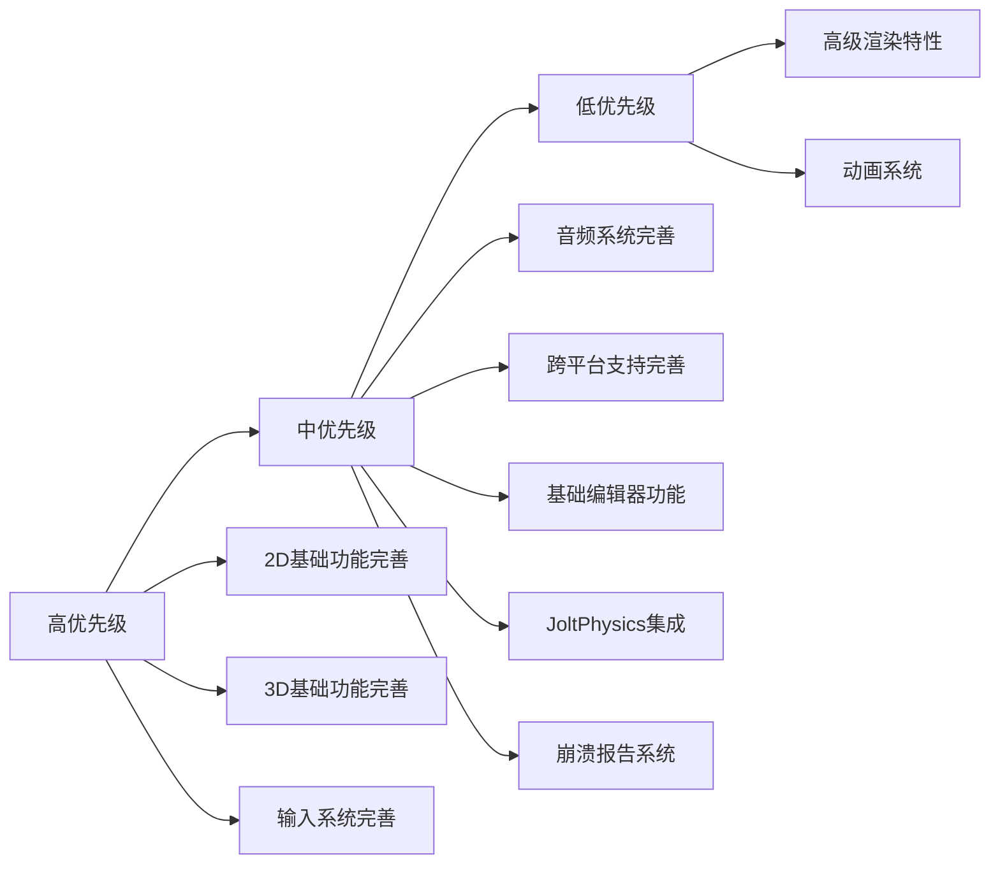

# YAGE 功能需求列表

## 简介

本文档总结了 YAGE (Yet Another Game Engine) 游戏引擎的功能需求，按照模块进行组织，方便跟踪开发进度和优先级。

## 核心架构需求

### 资源管理系统
- [x] 基础资源接口(IResource)和资产基类(Asset)
- [x] 资源管理器(ResourceManager)支持多路径搜索
- [x] 支持JSON和二进制序列化
- [x] 线程安全的资源加载和卸载

### 组件系统
- [x] 基础组件接口(IComponent)和组件基类(Component)
- [x] GameObject支持组件添加和获取
- [ ] 组件更新机制完善

## 2D功能需求

### 渲染系统
- [x] DirectX 12渲染器基础实现
  - [x] 基础渲染管线设置
  - [x] 命令列表和命令队列
  - [x] 渲染目标和视口设置
  - [x] 基础帧同步机制
- [ ] DirectX 12渲染器完善
- [ ] 着色器系统完善
  - [x] HLSL着色器编译支持
  - [x] 顶点和像素着色器加载
  - [ ] 着色器资源管理完善
- [ ] 纹理系统完善
  - [x] 基础纹理资产类(TextureAsset)
  - [x] 简单BMP图像加载
  - [ ] 纹理属性和元数据管理完善

### 几何体系统
- [x] 基础2D几何体
  - [x] 三角形网格生成
  - [x] 四边形网格生成
  - [x] 顶点数据结构定义

### 相机系统
- [x] Camera2D完整实现
  - [x] 支持2D投影和视图矩阵计算
  - [x] 支持视口和缩放功能
  - [x] 支持正交投影参数设置

### 变换系统
- [x] Transform2D完整实现
  - [x] 支持2D位置、旋转和缩放功能
  - [x] 支持变换矩阵计算
  - [x] 支持脏标记优化

### 渲染管线
- [ ] 2D专用渲染管线
  - [ ] 缺少2D图形的专用渲染状态
  - [ ] 缺少精灵渲染支持
  - [ ] 缺少UI渲染支持
  - [ ] 缺少2D光照系统

### 材质系统
- [ ] Material完善
  - [x] 类已声明
  - [x] 基础的资源加载和卸载
  - [ ] Apply()方法实现
  - [ ] 2D/3D材质属性完善
  - [ ] 纹理绑定和采样器设置

### 网格渲染
- [ ] MeshRenderer完善
  - [x] 基础结构已定义
  - [x] DrawMesh方法已实现，支持索引和非索引绘制
  - [x] 支持子网格渲染
  - [ ] 2D网格的专用渲染逻辑
  - [ ] 材质应用功能完善

### 输入系统
- [ ] IInputBackend完善
  - [x] 基础接口已定义
  - [x] 支持键盘和鼠标输入接口
  - [ ] 具体输入后端实现
  - [ ] 2D输入事件处理

## 3D功能需求

### 渲染系统
- [x] DirectX 12渲染器基础实现（同2D）
- [ ] Vulkan渲染器完善
  - [x] 基础渲染器类定义
  - [x] 支持多线程和Bindless纹理特性
  - [ ] 完整实现

### 几何体系统
- [x] 基础3D几何体
  - [x] 立方体网格生成
  - [x] 三角形和四边形网格生成
  - [x] 完整的顶点数据结构(位置、法线、纹理坐标、切线、颜色)

### 网格系统
- [ ] Mesh完善
  - [x] 子网格支持
  - [x] 包围盒计算
  - [x] 顶点和索引缓冲区结构
  - [x] GPU资源句柄定义
  - [ ] 完整实现

### 变换系统
- [ ] Transform完善
  - [x] 类已声明
  - [x] 支持3D位置、旋转和缩放属性
  - [ ] 完整的3D矩阵计算和层级变换
  - [ ] GetMatrix()方法完整实现

### 相机系统
- [ ] 3D相机实现
  - [ ] 透视和正交投影
  - [ ] 视图矩阵计算

### 渲染管线
- [ ] 3D专用渲染管线
  - [ ] 深度缓冲和模板缓冲
  - [ ] 背面剔除
  - [ ] 3D光照系统
  - [ ] 阴影渲染

### 材质系统
- [ ] 3D材质实现
  - [ ] PBR材质属性
  - [ ] 纹理绑定和采样器设置
  - [ ] 材质属性与着色器的绑定

### 网格渲染
- [ ] 3D网格渲染
  - [ ] 3D网格的专用渲染逻辑
  - [ ] 实例化渲染
  - [ ] LOD系统

### 动画系统
- [ ] 骨骼动画
  - [ ] 骨骼和蒙皮系统
  - [ ] 动画播放和混合
  - [ ] 动画状态机

### 物理系统
- [ ] 碰撞检测
  - [ ] 碰撞体和碰撞检测
  - [ ] 物理模拟
  - [ ] 物理材质

## 跨平台功能需求

### Windows平台支持
- [x] Windows应用程序框架
- [x] Win32窗口创建和消息处理
- [x] DirectX 12渲染后端
- [ ] 功能完善

### Android平台支持
- [x] Android应用程序类定义
- [ ] 完整的Android实现
- [ ] Android特定的渲染后端

### SDL3集成
- [x] SDL3应用程序类定义
- [ ] 完整的SDL3实现
- [ ] SDL3渲染后端

## 音频系统需求

### 音频系统架构
- [x] 音频系统接口定义
- [x] 多后端支持架构
- [x] 支持SDL3和XAudio2后端

### SDL3音频后端
- [x] 基础SDL3音频初始化
- [ ] 音频播放功能完善
- [ ] 音频控制功能完善

### XAudio2音频后端
- [x] 类定义已存在
- [x] 部分实现已完成
- [ ] 音频播放功能完善

## 工具和编辑器需求

### 编辑器框架
- [x] 编辑器应用程序类定义
- [x] SDL3窗口创建和初始化
- [x] Vulkan渲染器集成
- [x] ImGui界面框架集成
- [x] 资源管理器集成
- [ ] 功能完善

### 编辑器功能
- [ ] 场景编辑器
- [ ] 资源管理器
- [ ] 属性编辑器

### 崩溃报告系统
- [ ] Crashpad集成
- [ ] 崩溃捕获和报告机制
- [ ] 崩溃数据上传功能
- [ ] 符号化工具集成

## 优先级排序

### 🔴 高优先级
- 完善2D基础功能
  - 完善2D渲染管线
  - 完善2D材质系统
- 完善3D基础功能
  - 实现Transform3D和Camera3D
  - 完善3D渲染管线
  - 实现基础3D材质系统
- 完善输入系统
  - 实现输入后端
  - 添加输入事件处理

### 🟡 中优先级
- 完善音频系统
- 完善跨平台支持
- 实现基础编辑器功能
- 集成JoltPhysics物理引擎
- 集成Crashpad崩溃报告系统

### 🟢 低优先级
- 高级渲染特性
- 动画系统

## 功能完成度统计

## 开发优先级图

