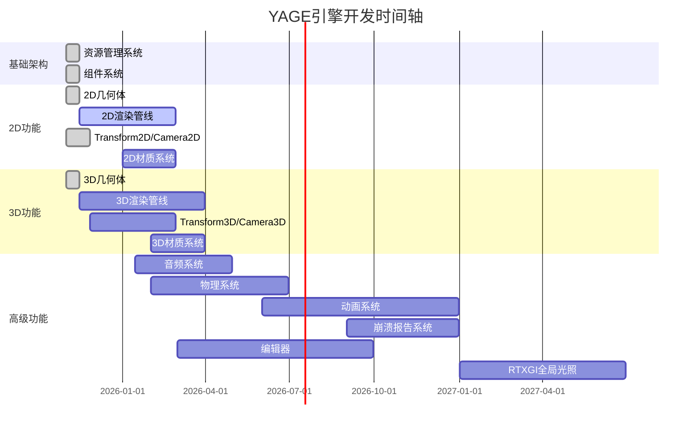

# 🎮 YAGE (Yet Another Game Engine) 功能路线图

## 📋 项目概述
YAGE是一个为现代游戏开发设计的跨平台游戏引擎，支持Windows和Android平台，使用DirectX 12和Vulkan作为渲染后端，集成SDL3实现跨平台窗口和输入。

## 📅 开发时间轴

## 🎨 2D功能实现状态

### ✅ 已实现的2D功能

#### 🏗️ 基础架构
- **📦 资源管理系统** - ✅ 已实现
  - 基础资源接口(IResource)和资产基类(Asset)
  - 资源管理器(ResourceManager)支持多路径搜索
  - 支持JSON和二进制序列化
  - 线程安全的资源加载和卸载

- **🧩 组件系统** - ✅ 已实现
  - 基础组件接口(IComponent)和组件基类(Component)
  - GameObject支持组件添加和获取
  - 组件更新机制已实现
  - 组件生命周期管理（Initialize/Update/Shutdown）

#### 🖼️ 渲染系统
- **🎯 DirectX 12渲染器** - ✅ 已实现
  - 完整的DirectX 12渲染管线设置
  - 命令列表和命令队列
  - 渲染目标和视口设置
  - 基础帧同步机制
  - 动态顶点/索引缓冲区上传
  - 动态常量缓冲区支持
  - 交换链、渲染目标、深度缓冲实现
  - 设备丢失处理机制

- **🌟 着色器系统** - ✅ 已实现
  - HLSL着色器编译支持
  - 顶点和像素着色器加载
  - 着色器资源管理

- **🖼️ 纹理系统** - ✅ 已实现
  - 基础纹理资产类(TextureAsset)
  - BMP图像加载支持
  - 纹理属性和元数据管理

#### 📐 几何体
- **📐 基础2D几何体** - ✅ 已实现
  - 三角形网格生成
  - 四边形网格生成
  - 顶点数据结构定义

### 🚧 未完全实现的2D功能

#### 📷 相机系统
- **📷 Camera2D** - ✅ 已实现
  - 类已完整实现
  - 支持2D投影和视图矩阵计算
  - 支持视口和缩放功能
  - 支持正交投影参数设置

#### 🔄 变换系统
- **🔄 Transform2D** - ✅ 已实现
  - 类已完整实现
  - 支持2D位置、旋转和缩放功能
  - 支持变换矩阵计算
  - 支持脏标记优化
  - 支持矢量操作和标量操作

#### 🎨 渲染管线
- **🎨 2D专用渲染管线** - ⚠️ 部分实现
  - RenderPass2D类已定义，但Execute方法为空
  - 缺少2D图形的专用渲染状态
  - 缺少精灵渲染支持
  - 缺少UI渲染支持
  - 缺少2D光照系统

#### 🎭 材质系统
- **🎭 Material** - ✅ 已实现
  - 基础PBR材质属性实现
  - 支持纹理路径设置
  - 与着色器系统集成
  - 基础颜色、金属度、粗糙度、自发光属性
  - 纹理映射支持（反照率、法线、金属度、粗糙度、自发光）
  - ⚠️ 缺少运行时材质编辑器
  - ⚠️ 缺少材质实例系统

#### 🔲 网格渲染
- **🔲 MeshRenderer** - ✅ 已实现
  - 基础结构已定义
  - DrawMesh方法已实现，支持索引和非索引绘制
  - 支持子网格渲染
  - 支持网格和材质绑定
  - 组件生命周期管理
  - ⚠️ 缺少2D网格的专用渲染逻辑
  - ⚠️ 缺少批渲染优化

#### 🎮 输入系统
- **🎮 IInputBackend** - ⚠️ 部分实现
  - 基础输入管理器实现
  - 支持键盘输入检测
  - 支持鼠标输入检测
  - 支持鼠标位置获取
  - ⚠️ 缺少游戏手柄支持
  - ⚠️ 缺少输入映射系统
  - ⚠️ 缺少输入事件处理

## 🌐 3D功能实现状态

### ✅ 已实现的3D功能

#### 🏗️ 基础架构
- **📦 资源管理系统** - ✅ 已实现(同2D)
- **🧩 组件系统** - ✅ 已实现(同2D)

#### 🖼️ 渲染系统
- **🎯 DirectX 12渲染器** - ✅ 已实现(同2D)
- **🔥 Vulkan渲染器** - ⚠️ 部分实现
  - 基础渲染器类定义
  - 已集成到编辑器初始化流程
  - 实现了实例、表面和设备的创建
  - 支持多线程和Bindless纹理特性

- **🌟 着色器系统** - ✅ 已实现(同2D)
- **🎨 渲染管线** - ✅ 已实现
  - 模块化渲染通道设计（RenderPass）
  - 前向渲染管线完整实现
  - 包含深度预通道、不透明通道、透明通道
  - 天空盒渲染通道实现

#### 📐 几何体
- **📦 基础3D几何体** - ✅ 已实现
  - 立方体网格生成
  - 三角形和四边形网格生成
  - 完整的顶点数据结构(位置、法线、纹理坐标、切线、颜色)

#### 🔲 网格系统
- **🔲 Mesh** - ✅ 已实现
  - 子网格支持
  - 包围盒计算
  - 顶点和索引缓冲区结构
  - GPU资源句柄定义

### 🚧 未完全实现的3D功能

#### 🔄 变换系统
- **🔄 Transform** - ✅ 已实现
  - 基于Transform类实现（实际是3D变换）
  - 支持欧拉角和四元数旋转
  - 支持3D位置、旋转和缩放属性
  - 支持矩阵变换计算，使用缓存优化
  - 包含调试日志功能
  - ⚠️ 缺少专门的Transform3D类命名（目前所有变换都通过Transform类处理）

#### 📷 相机系统
- **📷 3D相机** - ✅ 已实现
  - 透视投影相机完整实现
  - 支持LookAt功能
  - 支持本地和世界坐标系移动
  - 实现了前、上、右向量的计算
  - 支持清除颜色设置
  - 使用脏标记优化矩阵更新
  - ⚠️ 缺少正交投影相机实现

#### 🎨 渲染管线
- **🎨 3D专用渲染管线** - ✅ 已实现
  - 深度缓冲和模板缓冲
  - 背面剔除
  - 3D光照系统基础
  - ⚠️ 缺少阴影渲染
  - ⚠️ 渲染图（RenderGraph）目前为空实现
  - ⚠️ 延迟渲染管线存在但可能不完整

#### 🎭 材质系统
- **🎭 3D材质** - ✅ 已实现(同Material系统)
  - PBR材质属性实现
  - 纹理绑定和采样器设置
  - 材质属性与着色器的绑定
  - ⚠️ 缺少材质预览功能
  - ⚠️ 缺少材质库管理
  - ⚠️ 缺少着色器变体系统

#### 🔲 网格渲染
- **🔲 3D网格渲染** - ✅ 已实现
  - 3D网格的专用渲染逻辑
  - MeshRenderer组件实现
  - 支持网格和材质绑定
  - ⚠️ 缺少实例化渲染
  - ⚠️ 缺少LOD系统
  - ⚠️ 缺少批渲染优化
  - ⚠️ 缺少遮挡剔除

#### 🎬 动画系统
- **🎬 骨骼动画** - ❌ 未实现
  - 缺少骨骼和蒙皮系统
  - 缺少动画播放和混合
  - 缺少动画状态机
  - 缺少动画骨骼支持

#### ⚡ 物理系统
- **⚡ 碰撞检测** - ❌ 未实现
  - 缺少碰撞体和碰撞检测
  - 缺少物理模拟
  - 缺少物理材质

## 🌍 跨平台功能

### ✅ 已实现
- **🪟 Windows平台支持** - ⚠️ 部分实现
  - Windows应用程序框架
  - Win32窗口创建和消息处理
  - DirectX 12渲染后端

### 🚧 未完全实现
- **🤖 Android平台支持** - ⚠️ 部分实现
  - Android应用程序类定义
  - 缺少完整的Android实现
  - 缺少Android特定的渲染后端

- **🎮 SDL3集成** - ⚠️ 部分实现
  - SDL3应用程序类定义
  - 缺少完整的SDL3实现
  - 缺少SDL3渲染后端

## 🔊 音频系统

### ✅ 已实现
- **🔊 音频系统架构** - ✅ 已实现
  - 音频系统接口定义
  - 多后端支持架构
  - 支持SDL3和XAudio2后端

### 🚧 未完全实现
- **🎵 SDL3音频后端** - ⚠️ 部分实现
  - 基础SDL3音频初始化
  - 音频播放功能部分实现
  - 音频控制功能未完全实现

- **🎶 XAudio2音频后端** - ⚠️ 部分实现
  - 类定义已存在
  - 部分实现已完成
  - 音频播放功能未完全实现

## ⚡ 物理系统

### 🚧 未完全实现
- **⚛️ JoltPhysics集成** - ❌ 未实现
  - 缺少JoltPhysics库集成
  - 缺少物理世界的创建和管理
  - 缺少碰撞体和刚体组件
  - 缺少物理材质系统
  - 缺少约束和关节系统

## 🚀 高级渲染系统

### 🚧 未完全实现
- **🌟 RTXGI全局光照** - ❌ 未实现
  - 缺少NVIDIA RTXGI SDK集成
  - 缺少DDGI (Dynamic Diffuse Global Illumination) 系统
  - 缺少实时全局光照计算
  - 缺少光照探头和反射捕获
  - 缺少基于硬件的光线追踪支持

## 🛠️ 工具和编辑器

### ✅ 已实现
- **🛠️ 编辑器框架** - ⚠️ 部分实现
  - 编辑器应用程序类定义
  - SDL3窗口创建和初始化
  - Vulkan渲染器集成
  - ImGui界面框架集成
  - 资源管理器集成

### 🚧 未完全实现
- **🛠️ 编辑器功能** - ❌ 未实现
  - 缺少场景编辑器
  - 缺少资源管理器
  - 缺少属性编辑器

- **🐛 崩溃报告系统** - ❌ 未实现
  - 缺少Crashpad集成
  - 缺少崩溃捕获和报告机制
  - 缺少崩溃数据上传功能
  - 缺少符号化工具集成

## 🎯 优先级建议

### 🔴 高优先级
1. **🎨 完善2D基础功能**
   - 实现Transform2D和Camera2D
   - 完善2D渲染管线
   - 实现基础2D材质系统

2. **🌐 完善3D基础功能**
   - 实现Transform3D和Camera3D
   - 完善3D渲染管线
   - 实现基础3D材质系统

3. **🎮 完善输入系统**
   - 实现输入后端
   - 添加输入事件处理

### 🟡 中优先级
1. **🔊 完善音频系统**
2. **🌍 完善跨平台支持**
3. **🛠️ 实现基础编辑器功能**
4. **⚡ 集成JoltPhysics物理引擎**
5. **🐛 集成Crashpad崩溃报告系统**

### 🟢 低优先级
1. **✨ 高级渲染特性**
   - **🚀 RTXGI (Real-Time Global Illumination) 集成**
     - 集成NVIDIA RTXGI SDK
     - 实现基于Voxel Cone Tracing的实时全局光照
     - 支持动态场景下的间接光照反射
     - 添加DDGI (Dynamic Diffuse Global Illumination) 支持
     - 优化移动端和低配设备的性能降级方案
2. **🎬 动画系统**

## 📊 功能完成度统计

| 功能模块 | 完成度 | 状态 |
|---------|--------|------|
| 基础架构 | 60% | 🟡 进行中 |
| 2D渲染 | 40% | 🟡 进行中 |
| 3D渲染 | 35% | 🟡 进行中 |
| 音频系统 | 20% | 🔴 未开始 |
| 跨平台支持 | 25% | 🔴 未开始 |
| 编辑器工具 | 20% | 🔴 未开始 |
| 物理系统 | 0% | 🔴 未开始 |
| 高级渲染(RTXGI) | 0% | 🔴 未开始 |
| 动画系统 | 0% | 🔴 未开始 |

## 📝 总结

Prisma Engine（原YAGE）仍处于早期开发阶段，虽然已有基础框架，但距离可用还有相当距离：

### 已完成的基础框架
- **渲染后端**：DirectX 12基础结构已搭建，但需要大量调试和优化
- **组件系统**：基础架构完成，但缺少序列化和高级功能
- **数学库**：向量、矩阵、四元数等基础数学功能
- **资源系统**：基础资源管理框架，但加载器不完整

### 面临的实际挑战
1. **渲染管线**：虽有框架，但实际渲染功能需要大量实现和调试
2. **调试困难**：缺少可视化工具，渲染问题难以定位
3. **集成复杂**：各系统间的集成比预期更复杂
4. **性能未知**：缺少性能分析，实际性能待验证

### 重新评估的开发时间
- **基础功能可用**：预计需要3-6个月
- **完整2D游戏支持**：预计需要6-12个月
- **基础3D游戏支持**：预计需要1-2年
- **完整游戏引擎**：预计需要2-3年

### 建议
1. 调整期望，认识到这是一个长期项目
2. 优先实现最小可演示版本
3. 尽早建立测试和验证流程
4. 考虑使用现有中间件减少开发负担

游戏引擎开发是一项复杂的系统工程，需要持续的投入和耐心。

---

*最后更新时间: 2025年12月14日*