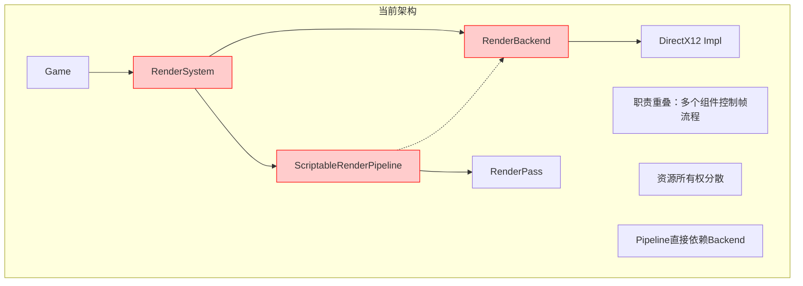
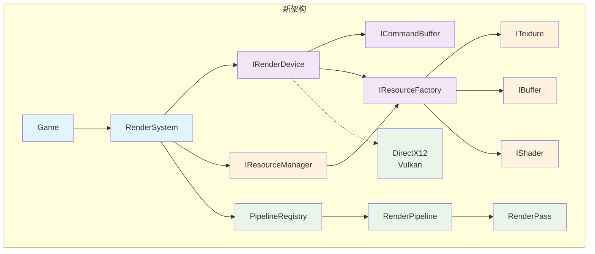
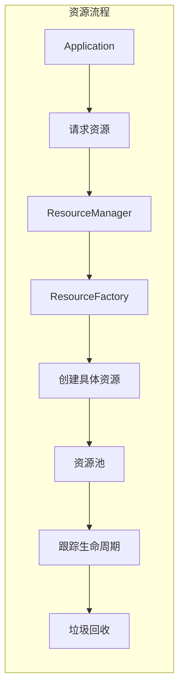
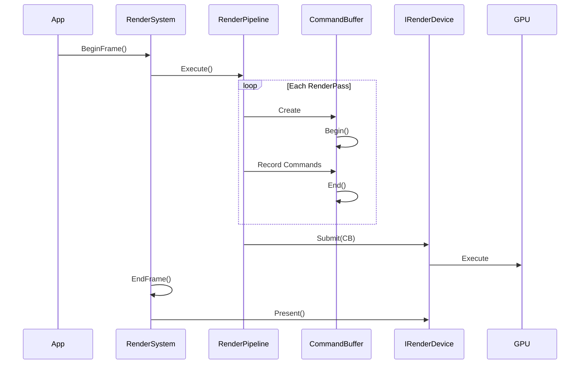
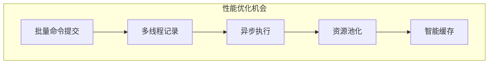

# 渲染架构对比

## 当前架构 vs 新架构

### 当前架构问题概览



### 新架构设计



## 核心改进点

### 1. 清晰的职责分离

| 组件 | 旧职责 | 新职责 |
|------|--------|--------|
| **RenderSystem** | - 控制渲染流程<br>- 管理后端<br>- 分发资源<br>- 处理帧渲染 | - 系统生命周期管理<br>- 协调各子系统<br>- 提供统一入口<br>- 后端选择 |

### 2. 资源所有权明确



### 3. 命令执行流程优化



## 接口对比

### 旧接口耦合

```cpp
// 旧方式：直接依赖具体实现
class RenderPass {
    void Execute() {
        // 直接获取后端
        auto* backend = RenderBackendDirectX12::Instance();
        // 直接操作具体API
        backend->GetCommandList()->DrawIndexed(...);
    }
};
```

### 新接口解耦

```cpp
// 新方式：通过抽象接口
class RenderPass {
    void Execute(ICommandBuffer* cmdBuffer) {
        // 使用抽象接口
        cmdBuffer->SetPipeline(m_pipeline);
        cmdBuffer->SetVertexBuffer(m_vertexBuffer);
        cmdBuffer->DrawIndexed(m_indexCount);
    }
};
```

## 扩展性对比

### 添加新的渲染后端

| 架构 | 旧方式 | 新方式 |
|------|--------|--------|
| **步骤** | 1. 修改多个文件<br>2. 处理特定逻辑<br>3. 风险高 | 1. 实现IRenderDevice<br>2. 注册到系统<br>3. 无需修改其他代码 |
| **影响** | 影响整个系统 | 零影响，即插即用 |
| **测试** | 需要回归测试 | 单独测试新后端 |

### 添加新的渲染特性

```cpp
// 旧架构：需要修改多个地方
class NewFeature {
    // 1. 修改RenderBackend
    // 2. 修改RenderPass
    // 3. 修改具体实现
};

// 新架构：只扩展需要的部分
class NewRenderPass : public RenderPass {
    void Execute(ICommandBuffer* cmdBuffer) override {
        // 使用现有的抽象接口实现新功能
    }
};
```

## 性能优化空间

### 命令缓冲区优化



### 资源管理优化

| 优化项 | 旧架构限制 | 新架构优势 |
|--------|------------|------------|
| **资源池** | 难以实现，资源分散 | 中央管理，易于池化 |
| **延迟删除** | 无法实现 | ResourceManager统一处理 |
| **异步加载** | 不支持 | 接口支持，易于实现 |
| **内存跟踪** | 困难 | 集中管理，实时跟踪 |

## 总结

新架构通过以下关键改进解决了当前问题：

1. **单一职责**：每个组件只负责一个明确的功能
2. **依赖倒置**：依赖抽象而非具体实现
3. **开闭原则**：对扩展开放，对修改关闭
4. **接口隔离**：提供最小化的接口
5. **资源集中**：统一管理所有资源生命周期

这些改进使得系统更加：
- **可维护**：清晰的代码结构
- **可扩展**：易于添加新功能
- **可测试**：各组件可独立测试
- **高性能**：优化空间更大
- **跨平台**：更好的平台抽象