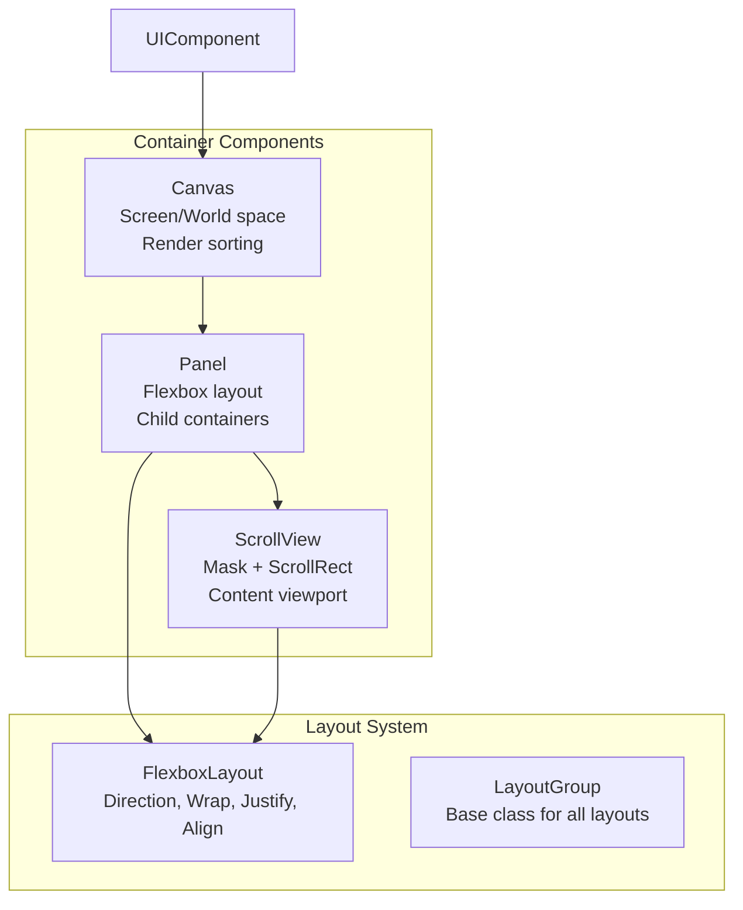

# C# UI System - Phase 2 Implementation Plan

**Date:** 2026-05-12  
**Goal:** Implement Canvas, Panel, and ScrollView components + Flexbox layout system for PrismaEngine C# UI system  
**Status:** Draft

## Architecture

Phase 2 extends Phase 1 with container components and layout system:



## Files to Create/Modify

```
projects/Template2D/scripts/PrismaEngine.Core/UI/
├── Canvas.cs           (NEW) - Canvas component
├── Panel.cs            (NEW) - Panel with Flexbox layout
├── ScrollView.cs       (NEW) - Scrollable container
├── FlexboxLayout.cs    (NEW) - Layout system
├── RectTransform.cs    (NEW) - Transform + anchors + pivot
└── Update existing files for integration
```

## Task Breakdown

### Task 1: RectTransform Component

**File:** `UI/RectTransform.cs` (NEW)

- Position, size, anchor, pivot management
- WorldRect computation
- Dirty flag for layout recalculation

```csharp
public partial class RectTransform : UIComponent
{
    public Vector2 AnchoredPosition { get; set; }
    public Vector2 Size { get; set; }
    public Vector2 AnchorMin { get; set; }
    public Vector2 AnchorMax { get; set; }
    public Vector2 Pivot { get; set; }
    public Vector2 OffsetMin { get; set; }
    public Vector2 OffsetMax { get; set; }
    public Rect WorldRect { get; }
    
    internal void SetDirty();
    internal void UpdateLayout();
}
```

### Task 2: Canvas Component

**File:** `UI/Canvas.cs` (NEW)

- Screen space vs World space modes
- Render queue management
- UI layer sorting

```csharp
public enum CanvasRenderMode
{
    ScreenSpaceOverlay,  // Render on top of everything
    ScreenSpaceCamera,   // Render at specific camera depth
    WorldSpace           // Attach to 3D objects
}

public partial class Canvas : UIComponent
{
    public CanvasRenderMode RenderMode { get; set; }
    public float PlaneDistance { get; set; } = 100f;
    public int SortOrder { get; set; }
    
    public void AddUIElement(Node element);
    public void RemoveUIElement(Node element);
    internal List<Node> GetElements();
}
```

### Task 3: FlexboxLayout Component

**File:** `UI/FlexboxLayout.cs` (NEW)

- NGUI-style flexbox layout
- Horizontal/Vertical direction
- Wrap, justify, align properties

```csharp
public enum FlexDirection
{
    Row,
    RowReverse,
    Column,
    ColumnReverse
}

public enum FlexWrap
{
    NoWrap,
    Wrap,
    WrapReverse
}

public enum FlexJustify
{
    FlexStart,
    Center,
    FlexEnd,
    SpaceBetween,
    SpaceAround
}

public enum FlexAlign
{
    FlexStart,
    Center,
    FlexEnd,
    Stretch
}

public partial class FlexboxLayout : UIComponent
{
    public FlexDirection Direction { get; set; } = FlexDirection.Row;
    public FlexWrap Wrap { get; set; } = FlexWrap.NoWrap;
    public FlexJustify JustifyContent { get; set; } = FlexJustify.FlexStart;
    public FlexAlign AlignItems { get; set; } = FlexAlign.Stretch;
    public FlexAlign AlignContent { get; set; } = FlexAlign.FlexStart;
    public Vector2 Spacing { get; set; }
    public Vector2 Padding { get; set; }
    
    internal void CalculateLayout();
}
```

### Task 4: Panel Component

**File:** `UI/Panel.cs` (NEW)

- Container for UI elements
- Optional flexbox layout
- Background image support

```csharp
public partial class Panel : UIComponent
{
    public Image? Background { get; set; }
    public FlexboxLayout? Layout { get; set; }
    public bool ClipChildren { get; set; } = false;
    
    public void AddChild(Node child);
    public void RemoveChild(Node child);
}
```

### Task 5: ScrollView Component

**File:** `UI/ScrollView.cs` (NEW)

- ScrollRect behavior
- Mask for content clipping
- Scrollbar integration

```csharp
public enum ScrollbarDirection
{
    Horizontal,
    Vertical,
    Both
}

public partial class ScrollView : Panel
{
    public ScrollbarDirection ScrollDirection { get; set; } = ScrollbarDirection.Vertical;
    public bool HorizontalScrollbar { get; set; } = false;
    public bool VerticalScrollbar { get; set; } = true;
    public float ScrollSensitivity { get; set; } = 50f;
    public bool Inertia { get; set; } = true;
    public float DecelerationRate { get; set; } = 0.05f;
    
    private Vector2 _contentOffset;
    private Vector2 _velocity;
    
    public Vector2 ContentOffset { get; set; }
    internal void UpdateScroll();
}
```

### Task 6: Build Verification

**Files:**
- Test: `PrismaEngine.Core.csproj`
- Test: `GameScripts.csproj`

---

## Task 1: RectTransform Component

- [ ] **Step 1: Create RectTransform.cs**

```csharp
using System;

namespace PrismaEngine.UI;

public partial class RectTransform : UIComponent
{
    public Vector2 AnchoredPosition { get; set; }
    public Vector2 Size { get; set; } = new Vector2(100, 100);
    public Vector2 AnchorMin { get; set; } = new Vector2(0.5f, 0.5f);
    public Vector2 AnchorMax { get; set; } = new Vector2(0.5f, 0.5f);
    public Vector2 Pivot { get; set; } = new Vector2(0.5f, 0.5f);
    public Vector2 OffsetMin { get; set; }
    public Vector2 OffsetMax { get; set; }
    
    public Rect WorldRect => CalculateWorldRect();
    
    private bool _isDirty = true;
    
    internal void SetDirty() => _isDirty = true;
    
    public override void OnUpdate(TimeContext time, InputContext input)
    {
        if (_isDirty)
        {
            UpdateLayout();
            _isDirty = false;
        }
    }
    
    internal virtual void UpdateLayout()
    {
    }
    
    private Rect CalculateWorldRect()
    {
        var worldPos = WorldPosition;
        return new Rect(
            worldPos.X - Size.X * Pivot.X,
            worldPos.Y - Size.Y * Pivot.Y,
            Size.X, Size.Y);
    }
}
```

- [ ] **Step 2: Build verification**

- [ ] **Step 3: Commit**

## Task 2: Canvas Component

- [ ] **Step 1: Create Canvas.cs**

```csharp
using System;
using System.Collections.Generic;

namespace PrismaEngine.UI;

public enum CanvasRenderMode
{
    ScreenSpaceOverlay,
    ScreenSpaceCamera,
    WorldSpace
}

public partial class Canvas : UIComponent
{
    public CanvasRenderMode RenderMode { get; set; } = CanvasRenderMode.ScreenSpaceOverlay;
    public float PlaneDistance { get; set; } = 100f;
    public int SortOrder { get; set; } = 0;
    
    private readonly List<Node> _elements = new();
    
    public Canvas()
    {
        ElementType = UIElementType.Canvas;
    }
    
    public override void OnCreate()
    {
        base.OnCreate();
        UIBridge.Instance.RegisterUIRoot(node);
    }
    
    public override void OnDestroy()
    {
        UIBridge.Instance.UnregisterUIRoot(node);
        base.OnDestroy();
    }
    
    public void AddElement(Node element)
    {
        if (element.Handle == 0) return;
        _elements.Add(element);
    }
    
    public void RemoveElement(Node element)
    {
        _elements.Remove(element);
    }
    
    internal List<Node> GetElements() => _elements;
}
```

- [ ] **Step 2: Build verification**

- [ ] **Step 3: Commit**

## Task 3: FlexboxLayout Component

- [ ] **Step 1: Create FlexboxLayout.cs**

```csharp
using System;
using System.Collections.Generic;

namespace PrismaEngine.UI;

public enum FlexDirection
{
    Row,
    RowReverse,
    Column,
    ColumnReverse
}

public enum FlexWrap
{
    NoWrap,
    Wrap,
    WrapReverse
}

public enum FlexJustify
{
    FlexStart,
    Center,
    FlexEnd,
    SpaceBetween,
    SpaceAround
}

public enum FlexAlign
{
    FlexStart,
    Center,
    FlexEnd,
    Stretch
}

public partial class FlexboxLayout : UIComponent
{
    public FlexDirection Direction { get; set; } = FlexDirection.Row;
    public FlexWrap Wrap { get; set; } = FlexWrap.NoWrap;
    public FlexJustify JustifyContent { get; set; } = FlexJustify.FlexStart;
    public FlexAlign AlignItems { get; set; } = FlexAlign.Stretch;
    public FlexAlign AlignContent { get; set; } = FlexAlign.FlexStart;
    public Vector2 Spacing { get; set; }
    public Vector2 Padding { get; set; }
    public float ChildForceExpandWidth { get; set; } = true;
    public float ChildForceExpandHeight { get; set; } = true;
    
    public FlexboxLayout()
    {
        ElementType = UIElementType.FlexboxLayout;
    }
    
    internal void CalculateLayout()
    {
        var children = _children;
        if (children.Count == 0) return;
        
        var containerWidth = Size.X - Padding.X * 2;
        var containerHeight = Size.Y - Padding.Y * 2;
        
        float totalFixedWidth = 0f;
        float totalFixedHeight = 0f;
        int flexibleChildren = 0;
        
        foreach (var child in children)
        {
            var childUI = child.GetScript<UIComponent>();
            if (childUI == null) continue;
            
            if (Direction == FlexDirection.Row || Direction == FlexDirection.RowReverse)
            {
                totalFixedWidth += childUI.Size.X;
                flexibleChildren++;
            }
            else
            {
                totalFixedHeight += childUI.Size.Y;
            }
        }
        
        float spacingX = Direction == FlexDirection.Row || Direction == FlexDirection.RowReverse 
            ? Spacing.X * (children.Count - 1) : 0;
        float spacingY = Direction == FlexDirection.Column || Direction == FlexDirection.ColumnReverse 
            ? Spacing.Y * (children.Count - 1) : 0;
        
        float availableWidth = containerWidth - totalFixedWidth - spacingX;
        float availableHeight = containerHeight - totalFixedHeight - spacingY;
        
        float flexUnit = flexibleChildren > 0 ? availableWidth / flexibleChildren : 0;
        
        float x = Padding.X;
        float y = Padding.Y;
        
        foreach (var child in children)
        {
            var childUI = child.GetScript<UIComponent>();
            if (childUI == null) continue;
            
            childUI.AnchoredPosition = new Vector2(x, y);
            
            if (Direction == FlexDirection.Row || Direction == FlexDirection.RowReverse)
            {
                x += childUI.Size.X + Spacing.X;
            }
            else
            {
                y += childUI.Size.Y + Spacing.Y;
            }
        }
    }
    
    public override void OnUpdate(TimeContext time, InputContext input)
    {
        CalculateLayout();
    }
}
```

- [ ] **Step 2: Build verification**

- [ ] **Step 3: Commit**

## Task 4: Panel Component

- [ ] **Step 1: Create Panel.cs**

```csharp
using System;

namespace PrismaEngine.UI;

public partial class Panel : UIComponent
{
    public Image? Background { get; set; }
    public bool ClipChildren { get; set; } = false;
    
    public Panel()
    {
        ElementType = UIElementType.Panel;
    }
    
    public override void OnCreate()
    {
        base.OnCreate();
        
        if (Background == null)
        {
            Background = new Image { Color = Color.White };
        }
    }
}
```

- [ ] **Step 2: Build verification**

- [ ] **Step 3: Commit**

## Task 5: ScrollView Component

- [ ] **Step 1: Create ScrollView.cs**

```csharp
using System;

namespace PrismaEngine.UI;

public enum ScrollbarDirection
{
    Horizontal,
    Vertical,
    Both
}

public partial class ScrollView : Panel
{
    public ScrollbarDirection ScrollDirection { get; set; } = ScrollbarDirection.Vertical;
    public bool HorizontalScrollbarEnabled { get; set; } = false;
    public bool VerticalScrollbarEnabled { get; set; } = true;
    public float ScrollSensitivity { get; set; } = 50f;
    public bool Inertia { get; set; } = true;
    public float DecelerationRate { get; set; } = 0.05f;
    
    private Vector2 _contentOffset;
    private Vector2 _velocity;
    private Node? _viewport;
    private Node? _content;
    
    public Vector2 ContentOffset
    {
        get => _contentOffset;
        set
        {
            _contentOffset = value;
            UpdateContentPosition();
        }
    }
    
    public ScrollView()
    {
        ElementType = UIElementType.ScrollView;
    }
    
    public override void OnCreate()
    {
        base.OnCreate();
    }
    
    private void UpdateContentPosition()
    {
        if (_content.Handle == 0) return;
        
        var contentUI = _content.GetScript<UIComponent>();
        if (contentUI != null)
        {
            contentUI.AnchoredPosition = _contentOffset;
        }
    }
    
    internal void OnScroll(Vector2 scrollDelta)
    {
        float sensitivity = ScrollSensitivity * 0.01f;
        
        if (ScrollDirection == ScrollbarDirection.Vertical || ScrollDirection == ScrollbarDirection.Both)
        {
            _contentOffset.Y += scrollDelta.Y * sensitivity;
        }
        
        if (ScrollDirection == ScrollbarDirection.Horizontal || ScrollDirection == ScrollbarDirection.Both)
        {
            _contentOffset.X += scrollDelta.X * sensitivity;
        }
        
        UpdateContentPosition();
    }
    
    public override void OnDrag(Vector2 position)
    {
        base.OnDrag(position);
    }
}
```

- [ ] **Step 2: Build verification**

- [ ] **Step 3: Commit**

## Task 6: Build Verification

- [ ] **Step 1: Build PrismaEngine.Core**

```bash
cd projects/Template2D/scripts
export DOTNET_GCRegionRange=0x10000000
dotnet build PrismaEngine.Core/PrismaEngine.Core.csproj
```

Expected: Build succeeds with no errors

- [ ] **Step 2: Build GameScripts**

```bash
dotnet build GameScripts/GameScripts.csproj
```

Expected: Build succeeds with no errors

- [ ] **Step 3: Commit all Phase 2 changes**

```bash
git add projects/Template2D/scripts/PrismaEngine.Core/UI/
git commit -m "feat(ui): add Phase 2 - Canvas, Panel, ScrollView, FlexboxLayout"
```

---

## Integration Notes

### Existing UIComponent modifications needed:

1. **Add `UIElementType` values:**
   - Canvas = 100
   - Panel = 101
   - ScrollView = 102
   - FlexboxLayout = 103

2. **Update `UIBridge` for Canvas registration:**
   - Already supports `RegisterUIRoot` - Canvas calls this in `OnCreate`

3. **RectTransform as base:**
   - Canvas, Panel, ScrollView inherit from RectTransform (or use it as composition)
   - For simplicity, keep current inheritance chain: UIComponent → RectTransform → specific components

### Build Order:
1. RectTransform (foundation)
2. Canvas (depends on nothing UI-specific)
3. FlexboxLayout (depends on UIComponent)
4. Panel (depends on FlexboxLayout)
5. ScrollView (depends on Panel)

---

## Success Criteria

- [ ] All new components compile without errors
- [ ] GameScripts project builds successfully
- [ ] No breaking changes to Phase 1 components
- [ ] Layout calculations work correctly
- [ ] Canvas registration works with UIBridge