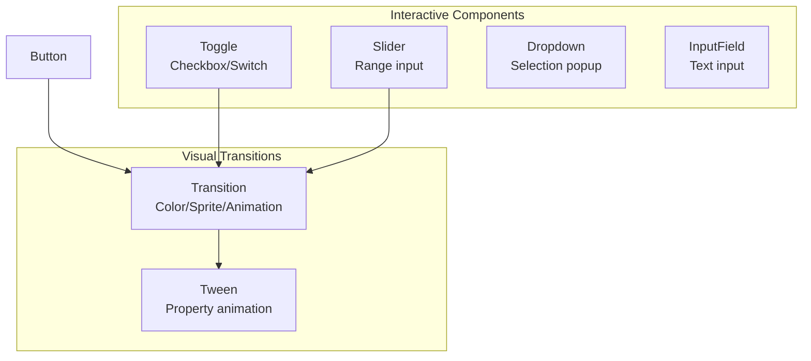

# C# UI System - Phase 3 Implementation Plan

**Date:** 2026-05-12  
**Goal:** Implement interactive components (Toggle, Slider, Dropdown, InputField) and visual transitions for PrismaEngine C# UI system  
**Status:** Draft

## Architecture

Phase 3 adds interactive components with state management and visual transitions:



## Files to Create

```
projects/Prisma2D/scripts/PrismaEngine.Core/UI/
├── Toggle.cs           (NEW) - Toggle/Switch component
├── Slider.cs           (NEW) - Slider/Scrollbar component
├── Dropdown.cs         (NEW) - Dropdown selection
├── InputField.cs       (NEW) - Text input field
├── Transition.cs       (NEW) - Visual state transitions
└── Tween.cs           (NEW) - Property animation system
```

## Task Breakdown

### Task 1: Toggle Component

**File:** `UI/Toggle.cs` (NEW)

- On/Off states
- Toggle group support
- Transition effects

```csharp
public partial class Toggle : UIComponent
{
    public bool IsOn { get; set; }
    public ColorBlock Colors { get; set; }
    public Sprite? OnSprite { get; set; }
    public Sprite? OffSprite { get; set; }
    
    public event Action<bool> OnValueChanged;
}
```

### Task 2: Slider Component

**File:** `UI/Slider.cs` (NEW)

- Min/Max values
- Whole numbers option
- Direction (horizontal/vertical)

```csharp
public partial class Slider : UIComponent
{
    public float MinValue { get; set; } = 0f;
    public float MaxValue { get; set; } = 1f;
    public float Value { get; set; } = 0.5f;
    public bool WholeNumbers { get; set; }
    
    public event Action<float> OnValueChanged;
}
```

### Task 3: Dropdown Component

**File:** `UI/Dropdown.cs` (NEW)

- Option list
- Caption text
- Popup panel

```csharp
public partial class Dropdown : UIComponent
{
    public List<string> Options { get; set; }
    public int SelectedIndex { get; set; }
    public Text Caption { get; set; }
    public Panel Popup { get; set; }
    
    public event Action<int, string> OnValueChanged;
}
```

### Task 4: InputField Component

**File:** `UI/InputField.cs` (NEW)

- Text content
- Character limit
- Placeholder text

```csharp
public partial class InputField : UIComponent
{
    public string Text { get; set; }
    public string Placeholder { get; set; }
    public int CharacterLimit { get; set; }
    public bool IsPassword { get; set; }
    
    public event Action<string> OnTextChanged;
    public event Action<string> OnEndEdit;
}
```

### Task 5: Transition System

**File:** `UI/Transition.cs` (NEW)

- Color transitions
- Sprite transitions
- Animation triggers

```csharp
public enum TransitionType
{
    None,
    ColorTint,
    SpriteSwap,
    Animation
}

public partial class Transition : UIComponent
{
    public TransitionType Type { get; set; }
    public ColorBlock Colors { get; set; }
    public Sprite? HighlightedSprite { get; set; }
    public Sprite? PressedSprite { get; set; }
    
    internal void PlayTransition(ButtonState state);
}
```

### Task 6: Tween System (Basic)

**File:** `UI/Tween.cs` (NEW)

- Float/Vector2/Color tweens
- Duration and easing
- Completion callbacks

```csharp
public enum EaseType
{
    Linear,
    InQuad,
    OutQuad,
    InOutQuad
}

public static class Tween
{
    public static void To(float from, float to, float duration, Action<float> onUpdate, Action? onComplete = null);
    public static void To(Vector2 from, Vector2 to, float duration, Action<Vector2> onUpdate, Action? onComplete = null);
}
```

### Task 7: Build Verification

---

## Task 1: Toggle Component

- [ ] **Step 1: Create Toggle.cs**

```csharp
using System;

namespace PrismaEngine.UI;

[Serializable]
public partial class Toggle : UIComponent
{
    public bool IsOn { get; set; } = false;
    public ColorBlock Colors { get; set; } = ColorBlock.Default;
    public Sprite? OnSprite { get; set; }
    public Sprite? OffSprite { get; set; }
    
    public event Action<bool>? OnValueChanged;
    
    public Toggle()
    {
        ElementType = UIElementType.Toggle;
    }
    
    public void SetIsOn(bool value, bool sendCallback = true)
    {
        if (IsOn == value) return;
        
        IsOn = value;
        UpdateVisual();
        
        if (sendCallback)
        {
            OnValueChanged?.Invoke(IsOn);
        }
    }
    
    public void ToggleValue()
    {
        SetIsOn(!IsOn);
    }
    
    private void UpdateVisual()
    {
        if (IsOn && OnSprite != null)
        {
            // Update sprite
        }
        else if (!IsOn && OffSprite != null)
        {
            // Update sprite
        }
        
        Color = IsOn ? Colors.NormalColor : Colors.DisabledColor;
    }
    
    public override void OnClick()
    {
        base.OnClick();
        ToggleValue();
    }
}
```

- [ ] **Step 2: Build verification**

- [ ] **Step 3: Commit**

## Task 2: Slider Component

- [ ] **Step 1: Create Slider.cs**

```csharp
using System;

namespace PrismaEngine.UI;

public enum SliderDirection
{
    LeftToRight,
    RightToLeft,
    BottomToTop,
    TopToBottom
}

[Serializable]
public partial class Slider : UIComponent
{
    public float MinValue { get; set; } = 0f;
    public float MaxValue { get; set; } = 1f;
    public float Value { get; set; } = 0.5f;
    public bool WholeNumbers { get; set; } = false;
    public SliderDirection Direction { get; set; } = SliderDirection.LeftToRight;
    
    public Image? Background { get; set; }
    public Image? FillImage { get; set; }
    public Image? HandleImage { get; set; }
    
    public event Action<float>? OnValueChanged;
    
    public Slider()
    {
        ElementType = UIElementType.Slider;
    }
    
    public void SetValue(float value, bool sendCallback = true)
    {
        float newValue = Math.Clamp(value, MinValue, MaxValue);
        
        if (WholeNumbers)
        {
            newValue = (float)Math.Round(newValue);
        }
        
        if (Math.Abs(Value - newValue) < 0.0001f) return;
        
        Value = newValue;
        UpdateVisual();
        
        if (sendCallback)
        {
            OnValueChanged?.Invoke(Value);
        }
    }
    
    private void UpdateVisual()
    {
        float normalized = (Value - MinValue) / (MaxValue - MinValue);
        
        if (FillImage != null)
        {
            FillImage.FillAmount = normalized;
        }
        
        if (HandleImage != null)
        {
            float handlePos = normalized * Size.X;
            HandleImage.AnchoredPosition = new Vector2(handlePos, HandleImage.AnchoredPosition.Y);
        }
    }
    
    internal void OnPointerDown(Vector2 position)
    {
        float normalized = (position.X - AnchorMin.X) / (Size.X - AnchorMin.X - AnchorMax.X);
        float newValue = MinValue + (MaxValue - MinValue) * normalized;
        SetValue(newValue);
    }
}
```

- [ ] **Step 2: Build verification**

- [ ] **Step 3: Commit**

## Task 3: Dropdown Component

- [ ] **Step 1: Create Dropdown.cs**

```csharp
using System;
using System.Collections.Generic;

namespace PrismaEngine.UI;

[Serializable]
public partial class Dropdown : UIComponent
{
    public List<string> Options { get; } = new();
    public int SelectedIndex { get; set; } = -1;
    public Text? CaptionText { get; set; }
    public Panel? PopupContainer { get; set; }
    public bool IsOpen { get; private set; }
    
    public event Action<int, string>? OnValueChanged;
    
    public string SelectedOption => SelectedIndex >= 0 && SelectedIndex < Options.Count 
        ? Options[SelectedIndex] 
        : "";
    
    public Dropdown()
    {
        ElementType = UIElementType.Dropdown;
    }
    
    public override void OnCreate()
    {
        base.OnCreate();
        
        if (CaptionText == null)
        {
            CaptionText = new Text { TextContent = "" };
        }
    }
    
    public void AddOption(string option)
    {
        Options.Add(option);
    }
    
    public void ClearOptions()
    {
        Options.Clear();
        SelectedIndex = -1;
    }
    
    public void Show()
    {
        IsOpen = true;
        
        if (PopupContainer != null)
        {
            PopupContainer.Visible = true;
        }
    }
    
    public void Hide()
    {
        IsOpen = false;
        
        if (PopupContainer != null)
        {
            PopupContainer.Visible = false;
        }
    }
    
    public void Select(int index)
    {
        if (index < 0 || index >= Options.Count) return;
        
        SelectedIndex = index;
        
        if (CaptionText != null)
        {
            CaptionText.TextContent = Options[index];
        }
        
        Hide();
        OnValueChanged?.Invoke(SelectedIndex, Options[index]);
    }
    
    public override void OnClick()
    {
        base.OnClick();
        
        if (IsOpen)
        {
            Hide();
        }
        else
        {
            Show();
        }
    }
}
```

- [ ] **Step 2: Build verification**

- [ ] **Step 3: Commit**

## Task 4: InputField Component

- [ ] **Step 1: Create InputField.cs**

```csharp
using System;
using System.Text;

namespace PrismaEngine.UI;

[Serializable]
public partial class InputField : UIComponent
{
    public string Text { get; set; } = "";
    public string Placeholder { get; set; } = "";
    public int CharacterLimit { get; set; } = 0;
    public bool IsPassword { get; set; } = false;
    public char PasswordChar { get; set; } = '*';
    
    public Text? ContentText { get; set; }
    public Text? PlaceholderText { get; set; }
    public Image? Background { get; set; }
    
    public event Action<string>? OnTextChanged;
    public event Action<string>? OnEndEdit;
    
    private StringBuilder _inputBuffer = new();
    
    public InputField()
    {
        ElementType = UIElementType.TextField;
    }
    
    public override void OnCreate()
    {
        base.OnCreate();
        
        if (ContentText == null)
        {
            ContentText = new Text { TextContent = "" };
        }
        
        if (PlaceholderText == null)
        {
            PlaceholderText = new Text { TextContent = Placeholder };
        }
    }
    
    public void SetText(string text)
    {
        if (CharacterLimit > 0 && text.Length > CharacterLimit)
        {
            text = text.Substring(0, CharacterLimit);
        }
        
        Text = text;
        UpdateDisplay();
        OnTextChanged?.Invoke(Text);
    }
    
    public void AppendCharacter(char c)
    {
        if (CharacterLimit > 0 && Text.Length >= CharacterLimit)
        {
            return;
        }
        
        _inputBuffer.Append(c);
        SetText(_inputBuffer.ToString());
    }
    
    public void DeleteLastCharacter()
    {
        if (_inputBuffer.Length > 0)
        {
            _inputBuffer.Length--;
            SetText(_inputBuffer.ToString());
        }
    }
    
    public void Clear()
    {
        _inputBuffer.Clear();
        Text = "";
        UpdateDisplay();
    }
    
    private void UpdateDisplay()
    {
        string displayText = IsPassword 
            ? new string(PasswordChar, Text.Length) 
            : Text;
        
        if (ContentText != null)
        {
            ContentText.TextContent = displayText;
        }
        
        if (PlaceholderText != null)
        {
            PlaceholderText.Visible = string.IsNullOrEmpty(Text);
        }
    }
    
    public void Submit()
    {
        OnEndEdit?.Invoke(Text);
    }
}
```

- [ ] **Step 2: Build verification**

- [ ] **Step 3: Commit**

## Task 5: Transition System

- [ ] **Step 1: Create Transition.cs**

```csharp
using System;

namespace PrismaEngine.UI;

public enum TransitionType
{
    None,
    ColorTint,
    SpriteSwap,
    Animation
}

public enum ButtonState
{
    Normal,
    Highlighted,
    Pressed,
    Disabled
}

public partial class Transition : UIComponent
{
    public TransitionType Type { get; set; } = TransitionType.ColorTint;
    public ColorBlock Colors { get; set; } = ColorBlock.Default;
    
    public Sprite? HighlightedSprite { get; set; }
    public Sprite? PressedSprite { get; set; }
    public Sprite? DisabledSprite { get; set; }
    
    private ButtonState _currentState = ButtonState.Normal;
    
    public Transition()
    {
    }
    
    internal void SetState(ButtonState state)
    {
        if (_currentState == state) return;
        
        _currentState = state;
        PlayTransition(state);
    }
    
    internal void PlayTransition(ButtonState state)
    {
        switch (Type)
        {
            case TransitionType.ColorTint:
                ApplyColorTransition(state);
                break;
            case TransitionType.SpriteSwap:
                ApplySpriteTransition(state);
                break;
            case TransitionType.Animation:
                PlayAnimation(state);
                break;
        }
    }
    
    private void ApplyColorTransition(ButtonState state)
    {
        var targetColor = state switch
        {
            ButtonState.Normal => Colors.NormalColor,
            ButtonState.Highlighted => Colors.HighlightedColor,
            ButtonState.Pressed => Colors.PressedColor,
            ButtonState.Disabled => Colors.DisabledColor,
            _ => Color.White
        };
        
        Color = targetColor * Colors.ColorMultiplier;
    }
    
    private void ApplySpriteTransition(ButtonState state)
    {
        var image = node.GetScript<Image>();
        if (image == null) return;
        
        switch (state)
        {
            case ButtonState.Normal:
                break;
            case ButtonState.Highlighted:
                if (HighlightedSprite != null) image.Sprite = HighlightedSprite;
                break;
            case ButtonState.Pressed:
                if (PressedSprite != null) image.Sprite = PressedSprite;
                break;
            case ButtonState.Disabled:
                if (DisabledSprite != null) image.Sprite = DisabledSprite;
                break;
        }
    }
    
    private void PlayAnimation(ButtonState state)
    {
    }
}
```

- [ ] **Step 2: Build verification**

- [ ] **Step 3: Commit**

## Task 6: Tween System

- [ ] **Step 1: Create Tween.cs**

```csharp
using System;
using System.Collections.Generic;

namespace PrismaEngine.UI;

public enum EaseType
{
    Linear,
    InQuad,
    OutQuad,
    InOutQuad,
    InCubic,
    OutCubic,
    InOutCubic
}

internal class TweenOperation
{
    public float Elapsed { get; set; }
    public float Duration { get; set; }
    public float From { get; set; }
    public float To { get; set; }
    public float CurrentValue { get; set; }
    public Action<float>? OnUpdate { get; set; }
    public Action? OnComplete { get; set; }
    public bool IsComplete { get; set; }
}

internal class TweenVector2Operation
{
    public float Elapsed { get; set; }
    public float Duration { get; set; }
    public Vector2 From { get; set; }
    public Vector2 To { get; set; }
    public Vector2 CurrentValue { get; set; }
    public Action<Vector2>? OnUpdate { get; set; }
    public Action? OnComplete { get; set; }
    public bool IsComplete { get; set; }
}

public static class Tween
{
    private static readonly List<TweenOperation> _floatTweens = new();
    private static readonly List<TweenVector2Operation> _vector2Tweens = new();
    
    public static void To(float from, float to, float duration, Action<float> onUpdate, Action? onComplete = null)
    {
        var tween = new TweenOperation
        {
            From = from,
            To = to,
            Duration = duration,
            Elapsed = 0,
            CurrentValue = from,
            OnUpdate = onUpdate,
            OnComplete = onComplete
        };
        
        _floatTweens.Add(tween);
    }
    
    public static void To(Vector2 from, Vector2 to, float duration, Action<Vector2> onUpdate, Action? onComplete = null)
    {
        var tween = new TweenVector2Operation
        {
            From = from,
            To = to,
            Duration = duration,
            Elapsed = 0,
            CurrentValue = from,
            OnUpdate = onUpdate,
            OnComplete = onComplete
        };
        
        _vector2Tweens.Add(tween);
    }
    
    internal static void Update(float deltaTime)
    {
        for (int i = _floatTweens.Count - 1; i >= 0; i--)
        {
            var tween = _floatTweens[i];
            
            tween.Elapsed += deltaTime;
            float t = Math.Min(tween.Elapsed / tween.Duration, 1f);
            
            tween.CurrentValue = tween.From + (tween.To - tween.From) * Ease(t, EaseType.OutQuad);
            tween.OnUpdate?.Invoke(tween.CurrentValue);
            
            if (t >= 1f)
            {
                tween.OnComplete?.Invoke();
                _floatTweens.RemoveAt(i);
            }
        }
        
        for (int i = _vector2Tweens.Count - 1; i >= 0; i--)
        {
            var tween = _vector2Tweens[i];
            
            tween.Elapsed += deltaTime;
            float t = Math.Min(tween.Elapsed / tween.Duration, 1f);
            
            float easeT = Ease(t, EaseType.OutQuad);
            tween.CurrentValue = new Vector2(
                tween.From.X + (tween.To.X - tween.From.X) * easeT,
                tween.From.Y + (tween.To.Y - tween.From.Y) * easeT);
            
            tween.OnUpdate?.Invoke(tween.CurrentValue);
            
            if (t >= 1f)
            {
                tween.OnComplete?.Invoke();
                _vector2Tweens.RemoveAt(i);
            }
        }
    }
    
    public static float Ease(float t, EaseType type)
    {
        return type switch
        {
            EaseType.Linear => t,
            EaseType.InQuad => t * t,
            EaseType.OutQuad => t * (2f - t),
            EaseType.InOutQuad => t < 0.5f ? 2f * t * t : -1f + (4f - 2f * t) * t,
            EaseType.InCubic => t * t * t,
            EaseType.OutCubic => (--t) * t * t + 1f,
            EaseType.InOutCubic => t < 0.5f ? 4f * t * t * t : (t - 1f) * (2f * t - 2f) * (2f * t - 2f) + 1f,
            _ => t
        };
    }
    
    public static void StopAll()
    {
        _floatTweens.Clear();
        _vector2Tweens.Clear();
    }
}
```

- [ ] **Step 2: Build verification**

- [ ] **Step 3: Commit**

## Task 7: Build Verification

- [ ] **Step 1: Build PrismaEngine.Core**

```bash
cd projects/Prisma2D/scripts
export DOTNET_GCRegionRange=0x10000000
dotnet build PrismaEngine.Core/PrismaEngine.Core.csproj
```

- [ ] **Step 2: Build GameScripts**

```bash
dotnet build GameScripts/GameScripts.csproj
```

- [ ] **Step 3: Commit all Phase 3 changes**

```bash
git add projects/Prisma2D/scripts/PrismaEngine.Core/UI/
git commit -m "feat(ui): add Phase 3 - Toggle, Slider, Dropdown, InputField, Transition, Tween"
```

---

## Integration Notes

### Update UIElementType:

```csharp
public enum UIElementType
{
    Image = 0,
    Button = 1,
    Text = 2,
    Panel = 3,
    ScrollView = 4,
    Slider = 5,        // NEW
    Toggle = 6,        // NEW
    Dropdown = 7,      // NEW
    TextField = 8,     // NEW (InputField)
    ContextMenu = 9,
    Canvas = 100,
    FlexboxLayout = 101,
    RectTransform = 102
}
```

### Tween Update Integration:

Add to your game loop:
```csharp
Tween.Update(deltaTime);
```

---

## Success Criteria

- [ ] Toggle works with OnValueChanged event
- [ ] Slider respects Min/Max and WholeNumbers
- [ ] Dropdown shows/hides popup correctly
- [ ] InputField handles character limit and password mode
- [ ] Transition plays correctly for all ButtonState values
- [ ] Tween animations complete and cleanup properly
- [ ] All components build without errors